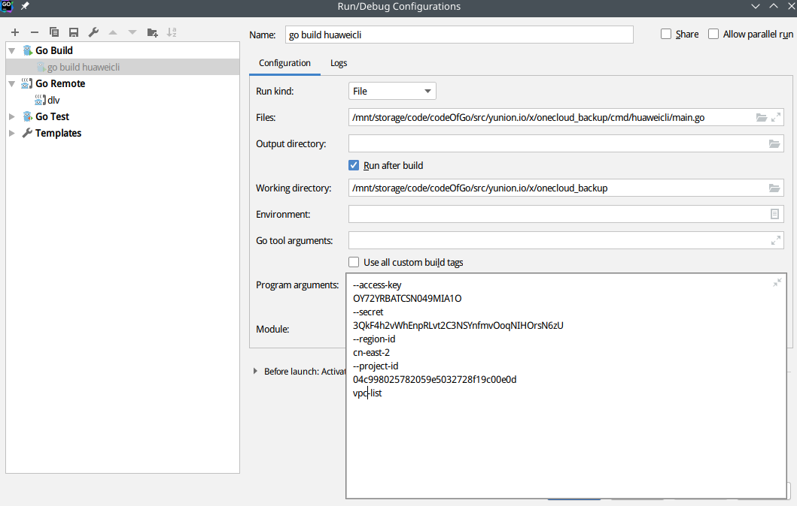
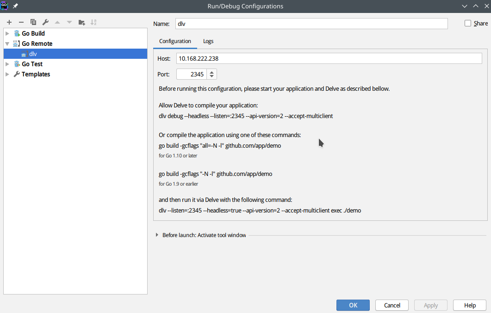

## 安装 Go

Golang 版本要求 1.12 以上

安装go环境参考: [Install doc](https://golang.org/doc/install)

## 编译 onecloud 组件

### Fork 仓库

访问 https://github.com/yunionio/onecloud ，将仓库 fork 到自己的 github 用户下。

### Clone 源码

git clone 前确保 GOPATH 等环境变量已经设置好，clone 你自己 fork 的仓库

```sh
$ git clone  https://github.com/<your_name>/onecloud $GOPATH/src/yunion.io/x/onecloud
$ cd $GOPATH/src/yunion.io/x/onecloud
$ git remote add upstream https://github.com/yunionio/onecloud
```

### 编译

```sh
# 编译所有组件
$ make

# cmd 目录下面存放着所有的组件:
$ ls cmd
...
ansibleserver    climc      glance      keystone  qcloudcli     ucloudcli
awscli           cloudir    host        lbagent   region        webconsole

# 可以编译cmd下制定的组件，比如：编译 region 和 host 组件
$ make cmd/region cmd/host

# 查看编译好的二进制文件
$ ls _output/bin
region host
```

## 开发流程

- 从 master checkout 出 feature 或者 bugfix 分支

```bash
# checkout 新分支
$ git fetch upstream --tags
$ git checkout -b feature/implement-x upstream/master
```

- 在新的分支上进行开发
- 开发完成后，进行提交PR前的准备操作

```bash
$ git fetch upstream         # 同步远程 upstream master 代码
$ git rebase upstream/master # 有冲突则解决冲突
$ git push origin feature/implement-x # push 分支到自己的 repo
```

- 在GitHub的Web界面完成提交PR的流程

  

- 提完 PR 后请求相关开发人员 review，并设置Labels来表明提交的代码属于哪一个模块或者哪几个模块


- 或者通过添加评论的方式来完成上一步；评论 "/cc" 并 @ 相关人员完成设置reviewer，评论/area 并填写label完成设置Labels


​	所有Label都可以在issues——Labels下查询到，带area/前缀的Label均可以使用评论"/area"的形式添加

- 如果是 bugfix 或者需要合并到之前 release 分支的 feature PR，需要额外使用脚本将此PR cherry-pick 到对应的 release 分支

```bash
# 自行下载安装 github 的 cli 工具：https://github.com/github/hub
# OSX 使用: brew install hub
# Debian: sudo apt install hub
# 二进制安装: https://github.com/github/hub/releases

# 设置github的用户名
$ export GITHUB_USER=<your_username>

# 使用脚本自动 cherry-pick PR 到 release 分支
# 比如现在有一个提交的PR的编号为8，要把它合并到 release/2.8.0
$ ./scripts/cherry_pick_pull.sh upstream/release/2.8.0 8
 
# cherry pick 可能会出现冲突，冲突时开另外一个 terminal，解决好冲突，再输入 'y' 进行提交
$ git add xxx # 解决完冲突后
$ git am --continue
# 回到执行 cherry-pick 脚本的 terminal 输入 'y' 即可
```

去 upstream 的 [PR 页面](https://github.com/yunionio/onecloud/pulls), 就能看到自动生成的 cherry-pick PR，上面操作的PR的标题前缀就应该为：`Automated cherry pick of #8`，然后重复 PR review 流程合并到 release

## 部署

TODO

## 调试

首先确保您已经完成部署并在本地clone了一份代码。

所有的组件均在cmd文件夹下，其中有一部分是客户端shell组件，可以通过他们向服务端发送一些命令，这部分组件的调试可以在goland中配置，下面是huaweicli组件的调试配置示例，配置好文件和参数即可：



对于在服务器端的组件的调试过程，我们主要是借助delve和goland进行远程调试，下面以region组件为例：

- 在make编译的时候设置环境变量

```bash
DLV=1 make cmd/region
```

  这样生成在`_output/bin`下的二进制文件会添加debug info，可以被delve调试

- 将新的可执行文件部署到服务器上去

  备份之前的region组件，通过scp命令将新的region文件上传到指定服务器中去，

```bash
mv /opt/yunion/bin/region  /opt/yunion/bin/region_backup
scp {your region path}/region  {your sever}:/opt/yunion/bin/region
```

- 停止之前的region服务，并使用dlv手动启动新的服务

```bash
systemctl stop yunion-region2.service

# 这是最关键的一步，这里的端口 2345 可以自定义，region.conf的位置也视实际情况
dlv --listen=:2345 --headless=true --api-version=2 exec /opt/yunion/bin/region -- --config /etc/yunion/region.conf
```

  如果成功的话就会显示下面一行：

```bash
API server listening at: [::]:2345
```

- 在goland上配置远程调试，配置如下为例：



  其中的Port要和在服务端配置的一样，Host就是服务端的IP

- 在region的代码里设置断点，然后点击菜单栏 Run——debug 'dlv'

通过使用shell组件climc可以向服务端发送各种命令，就可以对相应的代码进行调试

其他的服务端组件调试类似。