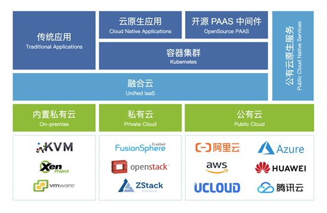

**作者:** 邱剑

随着数字化时代的到来，IT系统已成为人类社会正常运转不可或缺的组成部分。不远的未来，智能制造，5G和人工智能等技术将成为推动生产力发展的重要引擎，人类社会将面临前所未有的全面彻底的数字化浪潮。IT基础设施作为IT系统运行的平台和载体，是实现数字化的基石。在这场数字化浪潮中，企业必须积极拥抱云计算技术，采用符合技术发展趋势、面向未来的IT基础构架，才能在未来的竞争中赢得先机。

## 一、云计算历经十余年发展的趋势判断

云计算技术自2006年AWS推出第一个公有云服务S3开始，发展到2019年的今天，一些格局和趋势开始逐步清晰：

首先，私有云依然是大中型企业以及一些细分行业，例如政务、金融、医疗、教育、能源和制造等的首选IT基础设施。随着各大公有云厂商陆续推出其公有云在政企客户私有化部署的扩展方案，例如AWS Outposts、Azure Stack，Google Anthos，以及国内阿里云、腾讯云等的私有云／专有云部署方案，“私有云是否会随着公有云的发展逐步消亡”的命题已被公有云厂商自己否定。事实证明，私有云将长期持续存在，将和公有云共生，成为企业IT基础设施的一个重要组成部分。

其次，公有云持续迅猛发展，逐步成为企业IT基础设施的主要提供者。2018年Q3云硬件支出占IT总收入的50.9%。2018年中国私有云基础架构支出38.0亿美元，公有云基础架构支出达到82亿美元（来源：IDC）。因此，公有云已经成为IT基础设施的最主要提供者。尤其对于中小企业而言，其IT基础设施可能完全构建在公有云之上。同时，一些处于技术领先行业的大型企业，例如互联网，金融，制造等，也已经开始使用公有云，探索结合公有云和私有云优势的混合云架构。

与此同时，公有云市场竞争异常激烈，最后将只剩下少数技术和资本都十分雄厚的玩家，进入寡头垄断市场阶段。一方面，公有云厂商提供的产品和服务本质相同，都是IT基础设施资源以及其上的软件服务，另一方面，各家厂商都极力完善自身产品，丰富产品线，做出特色，以获得竞争优势，吸引增量用户，避免存量用户的流失。因此，最终公有云提供的产品功能矩阵都基本趋同，但是在特色功能、区域覆盖、用户体验方面则各有千秋，差异很大。随着用户对公有云产品服务依赖的加深，公有云之间的服务切换和迁移将变得越来越难，云和云之间存在隐形的鸿沟。当然，公有云进入寡头垄断阶段也意味着公有云供应商列表将长期保持相对稳定，这意味着针对所有公有云API的适配成本将变得可控可行。

还有一个不容忽视的趋势是Kubernetes已成为容器编排的事实标准，逐步成为云原生时代应用部署和运行的标准环境。随着Kubernetes对存储、网络支持的逐步完善，不仅无状态服务可以在Kubernetes上部署运行，有状态的数据存储服务也可以在Kubernetes上运行。同时，基于Kubernetes之上已经发展出了一个繁荣并且强大的开源软件生态和完整的工具链，例如Helm实现软件套件的自动部署，Operator实现软件的自动化运维，lstio提供微服务RPC通信治理架构，Knative提供Serverless的运行框架等等。可以预见，Kubernetes将成为未来分布式应用的标准运行时环境，成为分布式应用时代的“Linux”。Kubernetes之上将构建出一个完全由开源软件主导的软件生态，不仅仅包含应用软件，还包含各种PaaS中间件，例如消息中间件，各类开源数据库，开发框架，AI训练框架等，真正实现"开源统治世界"的愿景。正是基于这个趋势判断，各大公有云厂商都相继推出了自己的Kubernetes解决方案，允许原生Kubernetes在自己的云平台上更高效运行。

## 二、企业未来IT基础设施的确定和不确定

基于这些事实和趋势，我们可以想象未来的企业IT基础设施将是这样：

首先，混合云架构是企业的最佳选择。

将来企业的IT基础设施方案，公有云和私有云不再是二选一的选项，而是一个完整的IT基础设施的两个必然组成部分。一方面，企业可能会有自己的私有云，但也存在一些完全运行在公有云的企业。另一方面，企业必然会使用公有云，其购买的公有云资源将成为其私有IT基础设施的一部分。

其次，Kubernetes将会成为企业云原生应用的标准运行环境。

就像企业今天企业应用都运行在Linux中一样，将来的企业服务将云原生化，分布化，运行在Kubernetes中。企业将会有若干Kubernetes集群，运行着不同的应用，分布在不同的基础设施之上，有的运行在本地IDC，有的运行在私有云，有的运行在公有云。

以上两点是公认比较确定的论断，但是还有其他很多问题目前没有确定性的结论，例如：

1、虽然使用公有云是企业必然的选择，但是企业会在使用多个公有云还是单一公有云进行抉择。采用多公有云方案的原因很多，收益也显而易见，例如避免供应商锁定，提高议价的能力，获得更丰富的功能特性和地域选择等。但同时，使用多个公有云资源的统一管理难度大，云间服务切换和迁移成本较高的问题则阻碍了用户选择多个公有云。

2、虽然云计算技术发展了十多年，但是依然有很大比例的企业的本地IT基础设施并未云化，既没有通过私有云管理，甚至都没有采用虚拟化技术。虽然未来的云原生应用将运行在Kubernetes的容器环境中，但是企业还有很多未容器化的传统应用。而且，实事求是地讲，对于大多数企业来讲，也许未来很长一段时间，依然是以非云原生的传统应用为主。因此，企业未来的IT基础设施并不能简单地假设为全部都归一化地运行Kubernetes，而是应该给这些传统应用提供运行所需的虚拟机或者裸机环境。这类企业云转型过程中是否还是需要经过私有云-混合云-多云的漫长路径，再部署一套私有云实现本地IT基础设施的云化？

3、一方面，随着业务发展和行业驱动，企业对IT基础设施的要求，无论是规模、效率还是稳定性都将越来越苛刻。敏捷开发和DevOps将成为企业的标配。另一方面，随着技术的发展，企业IT基础设施也将愈发复杂和难以驾驭。企业IT资源将不仅是物理服务器，还有虚拟机，容器，除了x86，还会有小型机、ARM，甚至还有GPU、FPGA、TPU等异构计算资源。网络和存储也有多种技术选择。同时，截止今日，仅主流公有云供应商在全球200多个区域500多个可用区提供上千种云产品和服务。只要企业愿意，一个全球规模的IT基础设施唾手可得。企业IT人员如何应对IT基础设施在规模、效率和复杂度方面的挑战？

4、即使未来的企业IT基础架构将收敛到完全运行在Kubernetes上，单个Kubernetes集群往往只用于一个单一特定目的，例如特定部门的测试或生产集群，企业内有多个Kubernetes集群是常态。管理多Kubernetes集群，尤其是部署在多云环境下的多Kubernetes集群依然是一个难题。虽然Kubernetes屏蔽了底层基础设施的差异，向上提供了一致的接口和运行环境，但是Kubernetes在各个公有云以及本地IDC的管理接口以及网络存储方案都没有统一，在新建、扩容和调整配置Kubernetes集群时候，依然面临对接多个供应商接口的问题。同时，分布在多个公有云上的Kubernetes集群之间没有打通，不仅控制信息无法同步，数据链路层面更是相互隔离，互为孤岛。因此无法实现多个集群的联动，更无法实现集群之间的切换和协同。多云环境下的Kubernetes集群方案依然有待探索。 

5、随着Kubernetes生态的完善，用户在公有云上使用PaaS服务将有两个选择：使用公有云提供的PaaS服务还是基于Kubernetes的云原生开源PaaS服务。前者产品化程度高，更加易于使用，能得到商业支持。但也存在被商业产品锁定，切换困难，使用费用高昂的问题。使用后者则需要对开源软件有一定掌控力，但是价格便宜（云主机的使用费），基于开源技术，有强大社区支持，架构开放灵活且易于扩展。

## 三、融合云（Unified IaaS），面向未来的IT基础设施架构选择

针对以上确定性结论和不确定问题，我们的答案是面向未来的IT基础设施架构管理的最佳选择是融合云（Unified IaaS）。顾名思义，所谓融合云就是融合管理分布在多云环境（本地IDC，私有云和公有云）中的所有IT基础设施，构建一个“云上之云”的融合IaaS平台。融合云本质上是私有云，但是管理的IT资源的范围不再局限于本地IDC，还包括企业在公有云购买的IaaS资源。对于纯公有云架构的企业，融合云管理的则完全是企业购买的公有云资源。融合云和传统云平台的区别不在于管理的资源范围的不同，而在于针对上述企业IT的发展趋势和问题，在设计理念上，融合云和传统的云平台有如下不同：

首先，融合云面向的是多云环境。

融合云的部署场景中，企业用户IT基础设施不仅包含部署在本地IDC的部分，还包含用户在公有云购买的部分。融合云通过一个平台管理企业所有的IT基础设施。首先是在管理平面的统一和融合，实现私有云和公有云资源的统一API访问，不仅实现资源的管理，还包括账单的统一，资源管理的统一。让用户跨云调用就像使用一个云平台一样的便利。其次是数据平面的打通，通过和跨云网络方案的整合，实现控制平面和数据平台的协同，达到整个平台的跨云内网的互通。另外，融合云还将提供跨云数据迁移的工具，方便用户实现跨云的应用迁移。总之，融合云的目标就是填补云和云之间的鸿沟，降低跨云切换和迁移的成本，让多云部署更简单。

其次，融合云实现企业整体异构IT基础设施的全面云化。

融合云不仅能管理已经云化的私有云和公有云资源，还需内置了管理裸机的裸金属云，KVM和VMware ESXi等虚拟化技术、以及ARM，GPU等计算资源的私有云技术。对于还没有部署私有云的企业，通过部署融合云，一步到位地实现企业私有IT基础设施的私有云化，实现裸金属、KVM、VMware ESXi、GPU等的云化管理，无需再引入额外的私有云方案，降低了企业上云的实施成本和管理复杂度。

第三，智能将是融合云的核心特征。

融合云一方面优化IT资源分配的调度策略，找出闲置浪费的IT资源，提升IT资源的利用率。另一方面提前预测资源需求和发现系统故障隐患，确保系统的平稳运行和扩展。通过数据和算法，使得IT基础设施更加智能，帮助企业IT人员驾驭未来的IT基础设施在规模、效率和复杂度方面的挑战。 

第四，融合云面向的是Kubernetes。

融合云一方面实现多云环境下Kubernetes底层基础设施的统一和融合。一是通过统一的API为Kubernetes提供多云环境下统一的IaaS接口，为跨云部署Kubernetes环境提供便利。二是在数据平面打通跨云Kubernetes的内网，实现跨云通信。另一方面则直接提供统一的Kubernetes集群管理控制API以及集群信息的同步机制，实现跨集群Kubernetes的统一管控，实现跨Kubernetes集群的账号、权限、配置的同步和统一。

最后，融合云全面拥抱开源技术。

软件发展的历程表明PaaS的未来是开源。供应商都无法仅凭一己之力满足企业客户所有的PaaS需求。因此，融合云聚焦于企业分布在本地IDC和公有云的计算、网络和存储IaaS资源的统一管理，为多云Kubernetes提供可靠的底层基础设施，Kubernetes之上的软件和应用需求则依赖开源生态来提供解决方案。融合云用户对PaaS的需求通过Kubernetes应用市场，通过整合开源PaaS应用向用户提供服务。这一方面降低用户使用开源PaaS的技术门槛，另一方面则依赖强大的开源社区给用户提供开放灵活丰富的软件产品，避免私有PaaS软件对用户的锁定。

基于以上的设想，融合云的架构如下所示。

向下：融合云统一管理多云基础设施，主要实现多云环境下计算、网络、存储等IaaS资源的统一管理。对于本地IDC的未云化资源，主要是裸机，KVM虚拟机（Libvirt），VMware ESXi虚拟机（vSphere），通过内置的私有云方案实现云化管理。对于私有云和公有云资源，则通过API实现统一管理。

向上：融合云一方面通过虚拟机、裸机等形式为传统应用提供完整操作系统运行时环境，另一方面则给Kubernetes提供多云运行环境，统一管理多云Kubernetes。在Kubernetes之上则提供云原生应用的容器运行时环境。同时，基于Kubernetes和开源组件提供PaaS中间件服务。

总之，融合云向下统一管理多云IaaS资源；向上为Kubernetes提供多云支持，通过开源生态满足企业PaaS需求；用户其他需求则可以通过访问公有云的原生服务获得，从而全方位满足未来企业对IT基础设施的多层次需求。

随着大数据、人工智能技术的普及，5G时代的到来，IT基础设施变得愈加重要，成为企业数字化转型，全面拥抱数字时代的基石。基于企业IT架构多云趋势，融合云应运而生。融合云是面向未来的企业IT基础设施管理的云平台，针对企业在未来IT基础架构的问题而设计，将帮助企业迎接即将到来的数字化转型的挑战。
