**作者:** 周有松

各位朋友大家好，欢迎大家在周三的晚上参加我们的线上Meetup分享。我是周有松，目前负责云联壹云网络相关功能的开发工作，今天分享的题目是“云上负载均衡产品的应用”。

今天的内容会从以下几个方面展开：

* 负载均衡产品简介。主要介绍负载均衡作为一个云上产品，它的功能模型是怎样的，日常使用中会遇到的业务词汇
* 负载均衡的功能与典型应用场景。这部分主要结合业务词汇，对负载均衡服务中常见的一些功能选项进行介绍，并举例介绍一些典型的应用场景
* 最后，我们做一下总结，讨论一下负载均衡产品相比传统方式的优点

## 一、产品简介

### 1. 以NGINX为例

提到负载均衡，我们以前一般先会想到NGINX，或者淘宝的分支Tengine。我们先来看看

* 它是怎样工作的
* 它解决了什么样的问题
* 它适合什么样的应用场景

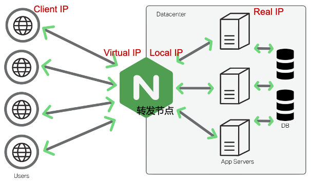

在加入了NGINX之后，客户端（Client IP）首先与NGINX建立连接（Virtual IP+Virtual Port），请求也先发给NGINX，再由NGINX从多个后端服务器中选择一台，建立连接后把请求转发给后端服务器（Real IP）。

NGINX作为网络转发节点，不参与后端服务的业务逻辑处理。而相比客户端直连后端，多个后端服务器可同时处理业务请求，应用的服务能力得到水平扩展。同时，转发节点上可以对后端做健康检查，自动屏蔽掉不健康的后端服务器，保障业务的高可用，使得单个后端服务器在故障、升级、过载时依然对用户连续可用。

因此，我们说水平扩展、高可用是负载均衡解决的最基本的两个问题。从另外一方面来说，使用负载均衡的业务，在架构设计上应该是能够水平扩展的。比如，一个应用的多个实例之间不需要通信，相互之间没有复杂的状态维护。

### 2. 业务词汇

在使用云上负载均衡的时候，不管哪个厂商的产品，我们会遇到一些常用的业务词汇。我们围绕一张图来简要介绍。

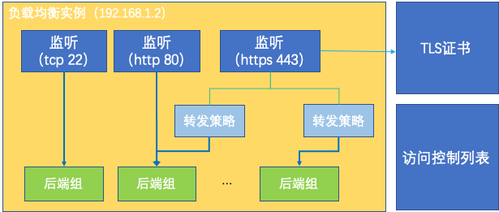

负载均衡实例，除了区域、可用区之外，每个实例至少有一个IP地址。同一个负载均衡实例下可以有多个监听，每个监听一般至少有协议、端口两个属性。后面还会介绍监听的其它属性，比如调度算法、健康检查、转发策略等。

实例和监听对应到NGINX上，其实是Virtual IP和Virtual Port的组合。每个监听有一个后端服务器组，组内可以有多个后端服务器，监听将来自客户端的请求转发给后端服务器（Real IP、Real Port）。

对于HTTPS协议的监听，我们还会遇到TLS证书的概念。

通常每个监听还可以绑定一个访问控制列表，用来设置黑名单、白名单，限定业务的服务范围。

将业务词汇放到转发模型上，我们可以得到这样一张图。在壹云的负载均衡实现中，转发节点使用HAProxy负责具体的流量转发。实例和监听的配置被转换为HAProxy的配置应用到转发节点上。HAProxy据此将流量转发到后端服务器组。

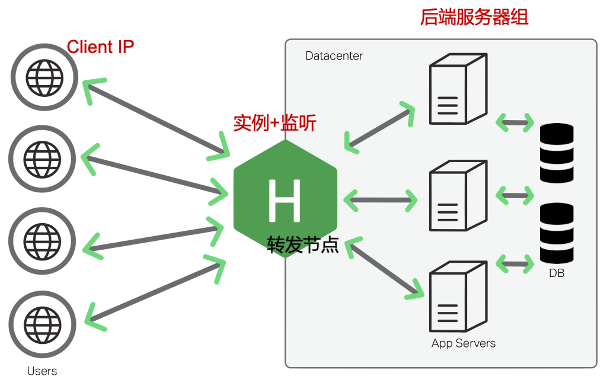

## 二、功能与应用场景

### 1. 监听协议

一般来说，负载均衡监听支持的传输层协议为TCP、UDP，应用层一般支持HTTP、HTTPS。其中对HTTP协议的支持一般包括HTTP/1.0，HTTP/1.1，HTTP/2，以及WS（WebSocket），WSS（WebSocket Secure）等。

除此之外，许多厂商的负载均衡产品也陆续开始了QUIC协议的支持。QUIC有时也被称作HTTP/3，它的传输层协议类型为UDP。壹云的负载均衡产品基于HAProxy，它将会随着HAProxy 2.5的发版实现对QUIC协议的支持。

同实例下的多个监听，传输层协议相同时，端口必须不能冲突。比如，同一实例下，无法TCP/80和HTTP/80的两个监听只能选其一。但是TCP/53和UDP/53的两个监听可以同时存在。

从开销来说，HTTPS因为涉及到TLS协商和传输加解密，开销最大。HTTP其次，相比TCP协议转发节点需要对传输的数据做内容解析。TCP作为有状态的连接，相比UDP开销又要大一些。

图中展示的是壹云控制台中负载均衡监听创建的第1步。其中，端口对所有协议类型都是必选的项。创建HTTPS监听时，要求必须关联相应的TLS证书。对于WS、WSS的支持是默认就有的。

主流的浏览器要求HTTP/2必须运行在加密信道上，一般来说，负载均衡产品对于HTTPS监听默认开启HTTP/2的支持。极个别情况下，某些应用的客户端遇到HTTP/2时会有兼容性问题，所以负载均衡产品通常也会提供开关，允许显式将HTTP/2支持关闭。

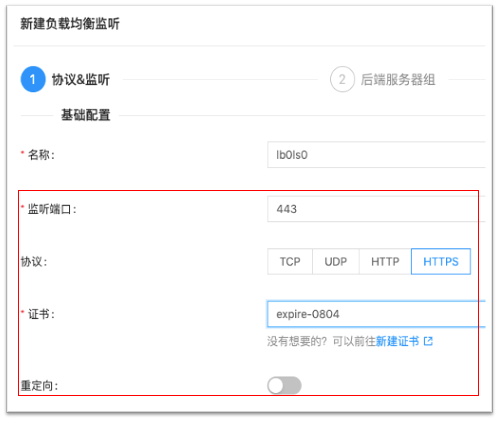

### 2. 调度算法

监听收到客户端的请求后，从后端服务器组中选出一个后端做转发。这个算法通常就叫“调度算法”。一般来说我们常用的有3种：

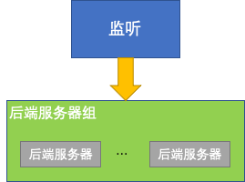

* 轮询，round robin。这种策略比较适用于短连接、短生命周期的业务，比如网页浏览。每打开一个网页，通常需要下载HTML、CSS、JS、字体等文档，每个请求大约秒级、毫秒级即可完成。这种场景下，轮询作为一种简单的算法，能够实现较好的均衡效果。
* 最小连接数，least connected。转发节点会记录它与每个监听的后端服务器的当前活跃的连接数，在转发请求时，从中选择一个活跃连接数最少的后端。这种算法较适合长连接、生命周期较长的业务，比如大文件上传下载、长时的交互会话如SSH等。
* 源一致性哈希。在这类算法中，转发节点通常会对请求来源标记一个身份，比如源IP地址、请求中的某个HTTP cookie值等。对于来自同一个标记的请求，将其转发到上次选择的后端服务器。这种算法较适合需要维护会话缓存、关联状态的业务。例如，某些业务后端收到请求后，需要从别处获取并缓存该请求相关的信息，比如订单详情、关联的用户详情等等，如果来自同一个用户的请求依然送到同一个后端，使得缓存使中率提高。这种对Locality的利用对应用的体验提升较好。

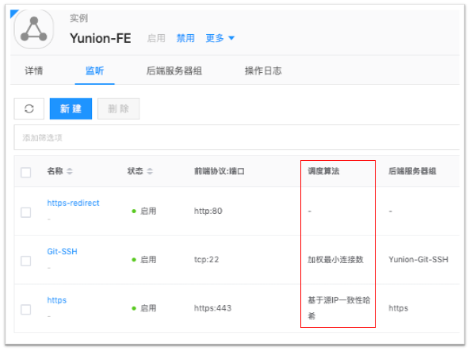

### 3.健康检查

健康检查是一种负载均衡服务实现高可用，保障业务连续性的机制。通过健康检查结果，转发节点将不健康的后端向用户屏蔽，实现故障、升级等行为对用户的无感知。

云上负载均衡的健康检查通常有以下几种：

* TCP检查。即通过TCP连接是否能够成功建立判断后端的健康与否，连接建立成功后会立即发出RST报文中断连接，减少后端资源占用。使用这种健康检查时，在后端的日志中可能会周期出现“connection reset”字样的信息，是预期中的效果。
* UDP检查。一般的机制是，向后端服务器发送指定内容的请求，在约定时间内若能收到来自后端的响应，并且响应内容匹配，则认为此次检查结果为健康。由于UDP是无状态连接协议，因此配置的参数里除了指定请求、响应的内容，还需指定响应超时时间。
* HTTP检查。通常通过向后端发送HEAD请求，对响应的状态码做检查来判断健康与否。默认的配置一般是2xx、3xx的响应判定为健康，4xx、5xx判定为故障。对状态码的归类一般也是可配置的。

云上负载均衡产品一般会某个后端的检查结果，作为一个初步诊断。一般会有连接超时、连接错误、响应错误等。当所有后端都被判定为不可用时，对于HTTP/HTTPS类型的监听，转发节点通常会直接返回503 Service Unavailable。

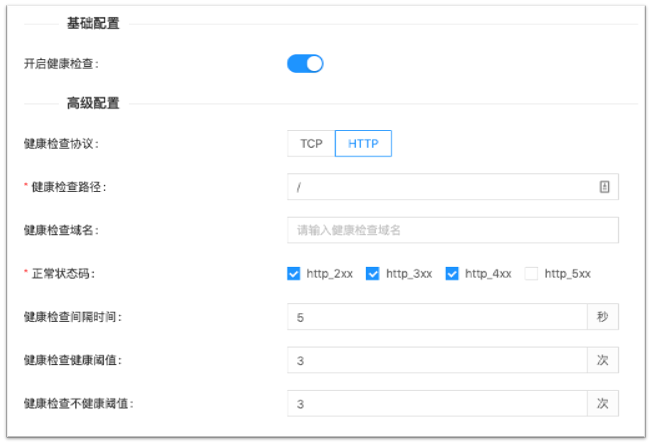

### 4. HTTP转发策略

转发策略是针对HTTP/HTTPS监听为言的。简单来说，它通过匹配用户请求中的Host、Path字段来决定将请求转发到哪个后端服务器组。

首先，同一监听下的多个转发策略共用一个IP、端口组合，实现了复用，并且业务的域名和路径统一管理，无需配置到每一台后端服务器上。例如，我们可以将wiki.example.com, task.example.com解析到同负载均衡实例的IP地址，然后创建一个HTTPS监听，再创建2个转发策略，分别匹配这两个域名，实现不同的转发路径。也可以通过共用域名解析，分配不同URL路径（/wiki，/task）的方式实现相同的效果。

另外，同一监听下的转发策略可以共用监听自身的ACL规则，共享监听的带单和速率控制，因此管理、配置会明晰简单。

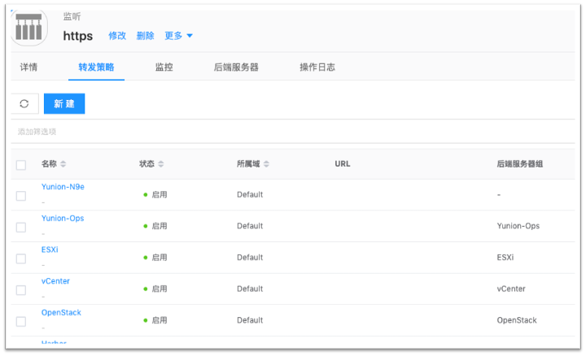

### 5. 会话保持

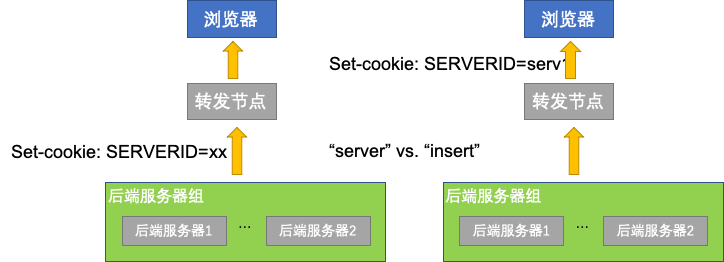

会话保持也叫Sticky Session，适用于HTTP/HTTPS类型的监听。它是一种通过在HTTP cookie中嵌入后端标识的方式指定请求的转发路径。根据Set-Cookie的时间不同，通常有两个选项：

Server模式。后端服务器知道自己的标识，在返回响应的时候给出Set-Cookie，经过转发节点交给浏览器后，记录在浏览器。转发请求下次收到该浏览器的请求时会看到相应的Cookie值，将其转发到上次的后端服务器。

Insert模式。转发节点收到后端服务器的响应后，再转发给浏览器前会加入Set-Cookie头部，这个值之后会记录在浏览器中。转发节点下次收到浏览器的请求时，若其中包含此cookie，它会将其去除之后再转发给后端服务器。因此，在Insert模式下，后端服务器感知不到此cookie的存在。

### 6. 跳转

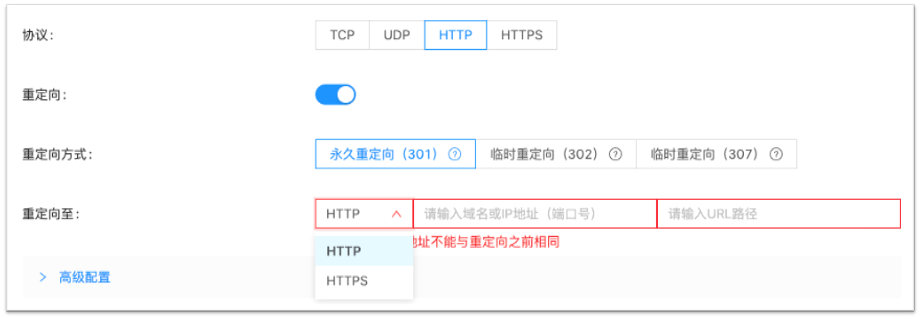

HTTP/HTTPS协议的监听可以指定跳转目标。这种情况下，监听无需绑定后端服务器组。

跳转类型的监听通常用来实现HTTP到HTTPS的跳转，实现全站加密访问。例如，在明文HTTP协议下，有些宽带运营商可能会篡改应用的响应，在其中插入广告等信息，某些情况下还可能导致信息安全问题。强制HTTPS跳转作为一种应对措施，可以帮助实现用户到站点的端到端保密信道。

另外，跳转还可以用来实现站点的迁移、应用的升级场景里。当迁移、升级完成后，通过跳转将用户请求转移到新站点，旧的URL依然可用，迁移升级过程对用户无感知，回滚也非常便捷。

### 7. 访问控制

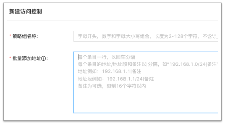

监听可以指定访问控制列表（ACL），并指定该列表的类型是黑名单还是白名单。

有时我们有一些内部接口、服务需要只能够有限开放，比如同公司另外一个机房，或者不同公司的合作伙伴等。此时通过访问控制列表实现就非常方便，在界面上统一管理、备注。

另外一种情况下，有些应用我们需要限定服务区域，比如版权、监管的原因等。此时我们可以将服务区域的来源地址做成白名单，仅开放应用给这些区域。网络控制在负载均衡一处完成，整个过程应用本身无需配置变更。

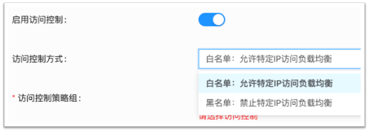

### 8. 获取客户端真实IP

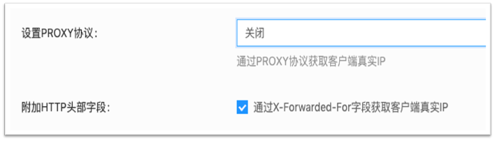

从产品简介中我们可以看到，客户端的连接和请求终结在转发节点上，后端服务器看到的连接都来自转发节点。此时，后端看到的网络层源IP也都是转发节点的地址。负载均衡产品一般提供提供了以下几种方式让后端服务器能够获取客户端的源IP地址：

对于HTTP/HTTPS协议，转发节点可以通过HTTP头部来传递客户端的源地址，头部的名称一般为X-Forwarded-For。

对于其它协议，一般通过PROXY协议来向后端服务器传递此信息。PROXY协议由HAProxy项目制订，AWS的负载均衡即支持此规范，另外还有NGINX、LightHTTPd也是支持此协议的。举例来说，对于TCP连接，PROXY协议会在连接建立后先进行连接信息传递，之后才是正常的数据交换。因此，如果PROXY协议直接对接应用服务，需要对应用服务的连接入口进行微小的修改。

一部分云厂商在整个负载均衡转发面实施会话记录、地址转换，使得虚机作为后端服务器时看到源地址即为客户请求的源地址，此时无需额外机制获得客户端的真实IP地址。需要注意的是，对于内网负载均衡，服务器在访问自身作为后端监听时，会出现因为源、目的IP地址都是自己而造成路径不通，这是这种机制的一个小限制。

### 9. 请求速率控制

壹云的负载均衡对于HTTP/HTTPS类型的监听可以实施请求速率控制。分为两个方面：

一是对监听整体进行速率控制。例如，某个应用现在的服务能力是每秒3000个请求，为了保护后端服务器，避免过载造成雪崩效应等，我们可以设定整体的速率控制。

二是对每个来源IP地址进行控制。这个可以用于阻止来自单个客户的高频异常请求，比如刷单、爬虫类请求等

### 10. TLS证书

最后，我们简单介绍一下TLS证书。用户在使用负载均衡时，经常反馈在证书上传这一步产生困惑。

首先，从非对称加密算法的类型来说，证书一般分别为RSA、EC证书两类。其中EC证书也叫椭圆曲线证书，相对较新一些，大部分平台也是支持的。

上传证书时，一般要求同时上传证书、私钥两个文件或文件的内容。这两者是成对出现的。云平台一般支持PEM格式的证书和私钥，为base64编码带标识头的文本格式。与之对应通常叫DER格式，它是ASN.1编码的二进制格式。如果用文本编辑器打开证书和私钥文件，看到的是规整的ASCII字符串，那么应该是PEM格式，如果是乱码状态，很可能就是DER格式了。

图中是常见的3种私钥PEM文件头。PKCS是RSA Laboratory制定的一系列标准。其中PKCS#8支持封装多种加密算法的私钥，因此此种格式的PEM私钥有可能是RSA或者EC格式的私钥。

图中展示了壹云控制台中证书列表的菜单位置。从中可以看到证书上传后，可以直接看到证书的CN（Common Name）。SAN（Subject Alternative Name），以及过期时间。在“操作”列中，若“删除”操作为灰色禁用状态，一般表示该证书正被HTTPS监听关联使用

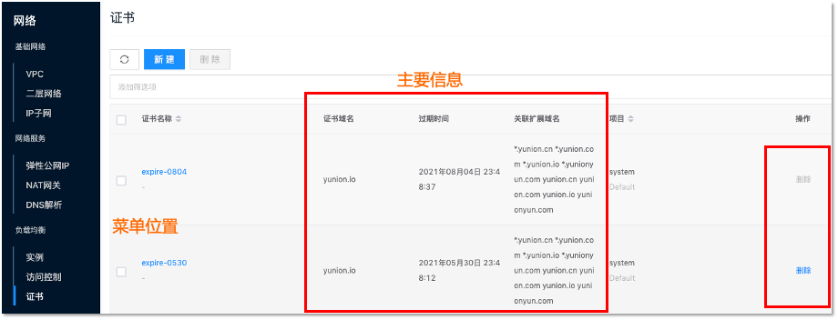

我们可以从证书的详情中，找到与它关联的监听列表，实现对所有监听批量更新证书。

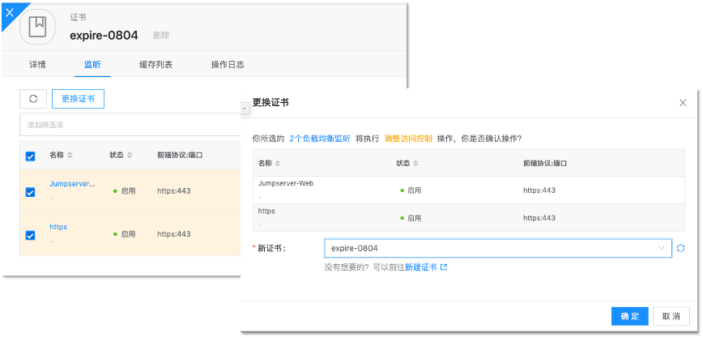

## 三、总结

以上结合实际的场景对负载均衡产品做了一个简略的介绍，我们经常被问到，这些功能特性都可以通过自己搭建NGINX一步一步配置出来，为什么还要花钱用云上的产品呢？

首先，作为一种模块化封装的产品，负载均衡的主要优势在于简便、高效。自建NGINX时，我们需要自己配置集群高可用，考虑集群的水平扩展和扩容。在生产环境时还需要配置自己的监控、告警策略。在管理层面，权限管理和操作过程审计也必不可少，然而NGINX作为基础组件与这些上层概念距离较远，需要较复杂的过程才可实现相等效果。

其次，云上负载均衡通常都有开放的API，可通过编程与周边系统对接，灵活应对需求。

从企业IT资产管理的角度来说，负载均衡代表着更先进的生产力。壹云控制台上的信息呈现相比命令行中单字符控制来说，更加一目了然，操作也更加简便，使得对于操作结果的可预期性更强。
