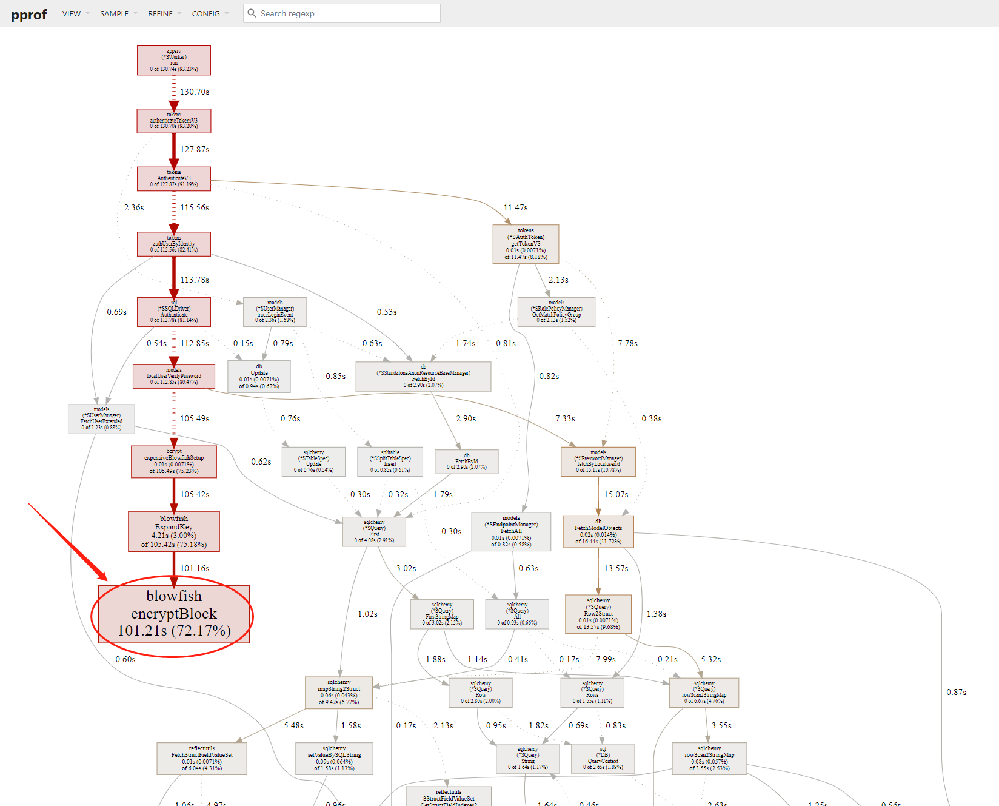

**作者:** 邱剑

有用户反馈keystone认证本地用户的接口性能很差，因此做了调研。

首先使用ab（apache benchmark）模拟用户认证，调用命令行如下：

```bash
ab -n 2000 -c 100 -p ~/auth_body.json -T 'application/json' http://192.168.1.248:5000/v3/auth/tokens
```

执行以上脚本过程中，采集keystone的pprof的profile数据：

```bash
wget http://192.168.1.248:5000/debug/pprof/profile
```

然后把profile数据文件拷贝到本地，用本地go tool打开一个http服务，查看profile的内容。

```bash
go tool pprof -http=0.0.0.0:8081 ~/profile
```

用浏览打开看，得到如下的调用图：



发现整个profile时间约130秒，调用blowfish encryptBlock的时间花了约101秒。查看代码发现这个是密码校验调用的方法bcrypt.CompareHashAndPassword。也就是说，70%的时间都花在验证本地用户的密码上了。

为什么这个bcrypt.CompareHashAndPassword方法这么慢呢？搜索google发现这个问答：

https://stackoverflow.com/questions/49437359/why-bcrypt-library-comparehashandpassword-method-is-slow

其中有一段文字：

    Besides incorporating a salt to protect against rainbow table attacks, bcrypt is an adaptive function: over time, the iteration count can be increased to make it slower, so it remains resistant to brute-force search attacks even with increasing computation power.

因此，采用bcrypt加密用户密码后，为了防止密码被暴力破解，用户认证接口的校验速度是故意地越压越慢的，性能必然不会好。
