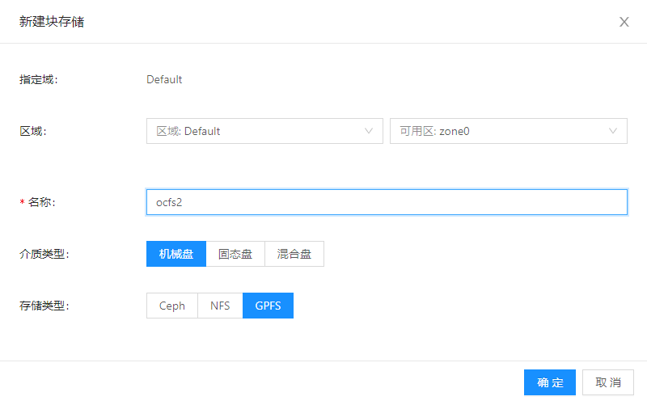

**作者:** 小助手

本文介绍OCFS2共享集群文件系统，如何配置以及如何在线扩容。

## 什么是OCFS2文件系统？

OCFS2是 Oracle Cluster File System Version 2 的缩写，是Oracle公司内部开发的共享磁盘文件系统，于2011年开源，使用GNU GPL协议。

什么是共享磁盘文件系统呢？我们下面通过解释三个概念的对比来说明：

* 磁盘文件系统

这是最常见的文件系统，构建在**本地**的磁盘（块存储，Block Storage）之上。通过磁盘文件系统，磁盘上的内容以文件目录的形式进行组织，方便了用户有效使用磁盘上的存储空间。磁盘文件系统的例子有：ext4, xfs等。

* 共享文件系统

共享文件系统通过远端服务器上运行的服务程序访问挂载在远端服务器上的文件系统。例子为：NFS（Network File System），Samba（CIFS）。

* 共享磁盘文件系统

共享磁盘文件系统又叫集群文件系统（Cluster File System），是专门构建在网络共享的磁盘上的文件系统。网络共享磁盘通过SAN（Storage Area Network）被多台主机共同访问，和磁盘文件系统相比，共享磁盘文件系统除了要解决磁盘空间的有效管理问题之外，还要解决文件系统被多台主机同时访问的并发修改问题。因此分布式锁机制是共享磁盘文件系统共有的机制。

从使用场景来看，三种文件系统的差别很明显：磁盘文件系统直接访问本地磁盘，共享文件系统需要通过共享文件服务访问挂载在服务器上的文件系统，而共享磁盘文件系统则直接访问共享磁盘。

因此，在网络共享的场景下，通过共享磁盘文件系统访问SAN存储，可以直接访问共享存储设备。访问路径短，效率高，并且能解决多主机并发访问共享存储的问题。

## QEMU通过OCFS2使用共享SAN存储

QEMU使用共享SAN存储有多种方案。常见方案是在需要新建虚拟机磁盘时，使用SAN存储的管理API，分配出卷（LUN）之后，直接将卷挂载给QEMU虚拟机使用。这种方案的优点是QEMU虚拟机直接访问LUN，损耗低，性能好。而缺点是需要使用存储设备特定的API，和设备绑定，不够通用。

本文介绍通过OCFS2共享磁盘文件系统，将一个大容量的SAN存储卷作为存储QEMU虚拟机虚拟磁盘文件的存储，达到QEMU使用共享储存的目的。

## OCFS2文件系统的配置

### 准备环境

这一步安装和配置软件

#### 下载和安装ocfs2-tools的rpm包安装（也依赖net-tools）

```bash
$ wget http://public-yum.oracle.com/public-yum-ol7.repo -O /etc/yum.repos.d/public-yum-ol7.repo
$ rpm --import http://public-yum.oracle.com/RPM-GPG-KEY-oracle-ol7
$ yum install yum-plugin-downloadonly -y
$ mkdir /tmp/ocfs2 && cd /tmp/ocfs2/
$ yum install --downloadonly --downloaddir=/tmp/ocfs2/ ocfs2-tools net-tools -y
```

具体操作步骤见官方文档：https://docs.oracle.com/cd/E52668_01/E54669/E54669.pdf, Chapter 23 Oracle Cluster File System Version 2

#### 安装Cloudpods内核，自带编译了ocfs2文件系统的内核模块

由于OCFS2使用场景较少，在常见发行版的内核中都不会启用OCFS2的内核模块。我们提供了预先编译好的启用了OCFS2的内核安装包：

```bash
$ yum install -y yum-utils
# 添加 yunion Cloudpods rpm 源
$ yum-config-manager --add-repo https://iso.yunion.cn/yumrepo-3.6/yunion.repo
$ yum install -y kernel-3.10.0-1062.4.3.el7.yn20191203
```

同时，部署时写配置文件到/etc/modules-load.d/ocfs2.conf，确保内核的ocfs2模块自动加载

```bash
# Load ocfs2.ko at boot
ocfs2
```

安装内核后需要重启生效，重启后检查新的内核已经生效

```bash
$ uname -r
3.10.0-1062.4.3.el7.yn20191203.x86_64
```

#### OCFS2配置文件

OCFS2配置简单，只需要在每个要挂载OCFS2的节点上都配置相同的配置文件，申明成员节点即可。

以下为示例配置文件:

```bash
$ cat /etc/ocfs2/cluster.conf 
cluster:
        node_count = 3            <== 集群节点数目
        name = ocfs2              <== 集群名字

node:
        ip_port = 7777
        ip_address = 192.168.7.10
        number = 0                <== 节点编号
        name = client01           <== 节点名字
        cluster = ocfs2
node:
        ip_port = 7777
        ip_address = 192.168.7.11
        number = 1
        name = client02
        cluster = ocfs2
node:
        ip_port = 7777
        ip_address = 192.168.7.12
        number = 2
        name = client03
        cluster = ocfs2
```

#### 初始化ocfs2的配置

```bash
$ o2cb.init configure      第一项选yes，集群名称填上面配置文件里的，默认是ocfs2
```

#### 确保o2cb ocfs2服务启动并设置为开机自启

```bash
systemctl enable o2cb ocfs2
```

至此，OCFS2的软件和配置完成，下一步将格式化磁盘，挂载OCFS2文件系统

### 挂载OCFS2文件系统

这一步使用OCFS2格式化网络共享磁盘，并且挂载到各台宿主机上

在此之前可能要配置SAN存储的多路径multipath(由于行文原因，细节在此省略)，在此之后使用parted分区，格式化成ocfs2（只在一台机器分区格式化，其他机器partprobe就能看到格式化后的分区）并挂载到多台机器

以下命令在第一个节点执行：

```bash
# 查看多路径multipath磁盘情况
$ multipath -l
```

使用mkfs.ocfs2格式化分区

```bash
$ parted /dev/dm-0
$ mkfs.ocfs2 /dev/dm-1
$ mount /dev/dm-1 /data
```

持久化磁盘挂载到/etc/fstab

```bash
# /etc/fstab
/dev/dm-1  /opt/cloud/workspace/disks  ocfs2     _netdev,defaults  0 0
```

在其他节点，则只需要执行partprobe探测分区变化，并且挂载分区。也应该修改/etc/fstab，持久化分区的挂载。

## Cloudpods使用OCFS2文件系统

在Cloudpods中，通过OCFS2挂载的共享文件系统可以作为GPFS类型的共享存储类型进行管理。通过以下步骤将OCFS2的共享存储注册到Cloudpods，并且用来存储虚拟机用的虚拟磁盘文件。

### 注册OCFS2块存储

在【存储-块存储】界面，新建一个GPFS类型的共享存储。



存储记录创建成功后，选择该存储的“管理宿主机”菜单按钮，在关联存储的宿主机列表，选择“关联宿主机”，将挂载该存储的宿主机节点都注册关联，让Cloudpods平台知道这个共享存储挂载到哪些宿主机的哪个目录下。

### 使用OCFS2创建主机虚拟磁盘

以上配置完成后，在新建虚拟机时，就可以选择新建的OCFS2存储作为虚拟磁盘的存储。

## OCFS2文件系统的扩容

首先需要将OCFS2只挂载在第一个节点，将其他节点都卸载。以下操作都只在第一个节点上执行。


首先，需要在SAN存储扩容该物理卷，这一步在SAN设备上操作，在此不详叙述。

其次，针对multipath设备，需要rescan该设备下的每个磁盘，让操作系统感知到设备的扩容。

```bash
# 首先执行 multipath -l 查看multipath设备底层的磁盘设备
$ multipath -ll
Jun 24 15:09:16 | ignoring extra data starting with '}' on line 16 of /etc/multipath.conf
Jun 24 15:09:16 | sdi: alua not supported
Jun 24 15:09:16 | sdb: alua not supported
Jun 24 15:09:16 | sdc: alua not supported
Jun 24 15:09:16 | sdd: alua not supported
Jun 24 15:09:16 | sde: alua not supported
Jun 24 15:09:16 | sdf: alua not supported
Jun 24 15:09:16 | sdg: alua not supported
Jun 24 15:09:16 | sdh: alua not supported
Jun 24 15:09:16 | sdq: alua not supported
Jun 24 15:09:16 | sdj: alua not supported
Jun 24 15:09:16 | sdm: alua not supported
Jun 24 15:09:16 | sdn: alua not supported
Jun 24 15:09:16 | sdo: alua not supported
Jun 24 15:09:16 | sdp: alua not supported
Jun 24 15:09:16 | sdk: alua not supported
Jun 24 15:09:16 | sdl: alua not supported
36488eef100d71ed122ace06c00000001 dm-0 HUAWEI  ,XSG1
size=15T features='1 queue_if_no_path' hwhandler='0' wp=rw
`-+- policy='service-time 0' prio=-1 status=active
  |- 1:0:7:1 sdi 8:128 active ready running
  |- 1:0:0:1 sdb 8:16  active ready running
  |- 1:0:1:1 sdc 8:32  active ready running
  |- 1:0:2:1 sdd 8:48  active ready running
  |- 1:0:3:1 sde 8:64  active ready running
  |- 1:0:4:1 sdf 8:80  active ready running
  |- 1:0:5:1 sdg 8:96  active ready running
  |- 1:0:6:1 sdh 8:112 active ready running
  |- 2:0:7:1 sdq 65:0  active ready running
  |- 2:0:3:1 sdj 8:144 active ready running
  |- 2:0:6:1 sdm 8:192 active ready running
  |- 2:0:0:1 sdn 8:208 active ready running
  |- 2:0:2:1 sdo 8:224 active ready running
  |- 2:0:5:1 sdp 8:240 active ready running
  |- 2:0:1:1 sdk 8:160 active ready running
  `- 2:0:4:1 sdl 8:176 active ready running
```

对每个设备执行：

```bash
echo 1 > /sys/class/block/sdi/device/rescan
```

再执行下面的命令，让操作系统感知到multipath设备的容量变化：

```bash
$ multipathd -k
# multipathd> resize map 36488eef100d71ed122ace06c00000001
# ok
# multipathd> exit
```

经过上面步骤，操作系统已经感知到设备的容量变化，这时候需要使用parted扩大分区表，方法是使用parted删除分区再重建分区

```bash
$ parted /dev/dm-0
(parted) unit s
(parted) p
Model: Linux device-mapper (multipath) (dm)
Disk /dev/dm-0: 32212254720s
Sector size (logical/physical): 512B/512B
Partition Table: gpt
Disk Flags:
 
Number  Start  End           Size          File system  Name   Flags
 1      2048s  10737416191s  10737414144s               disks
 
(parted) rm 1
(parted) mkpart
Partition name?  []?
File system type?  [ext2]?
Start? 2048
End? 100%
device-mapper: create ioctl on 36488eef100d71ed122ace06c00000001p1 part1-mpath-36488eef100d71ed122ace06c00000001 failed: Device or resource busy
(parted) p
Model: Linux device-mapper (multipath) (dm)
Disk /dev/dm-0: 32212254720s
Sector size (logical/physical): 512B/512B
Partition Table: gpt
Disk Flags:
 
Number  Start  End           Size          File system  Name  Flags
 1      2048s  32212252671s  32212250624s
 
(parted) quit
```

扩容分区表之后，再使用 tunefs.ocfs2 扩容文件系统


```bash
# 扩容文件系统
# tunefs.ocfs2 -S /dev/dm-1
```

经过以上步骤后，文件系统扩容完毕。最后，在其余节点执行partprobe感知设备的容量变化，再重新挂载分区就可以了。