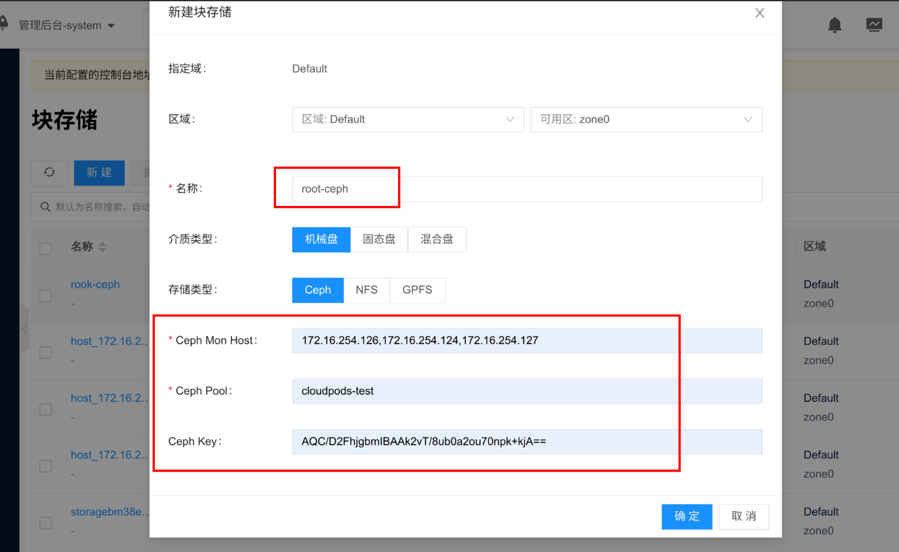
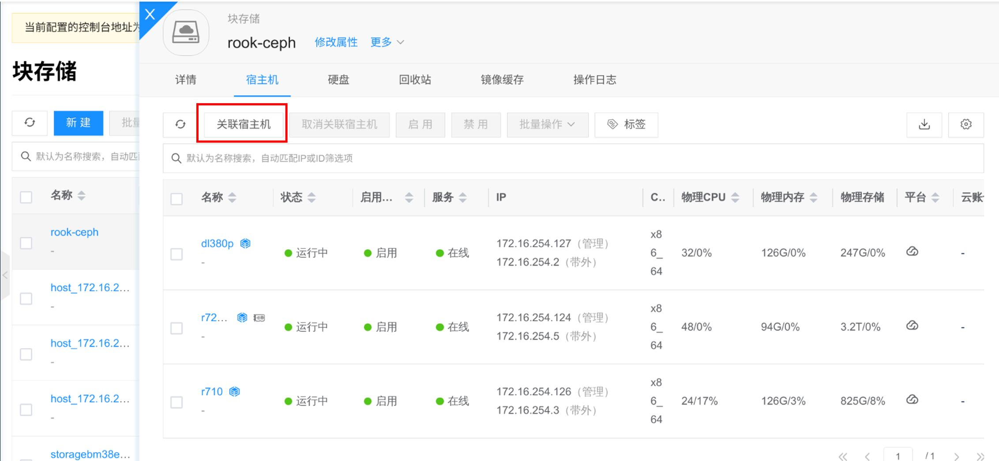
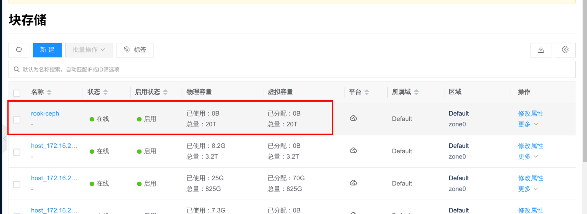
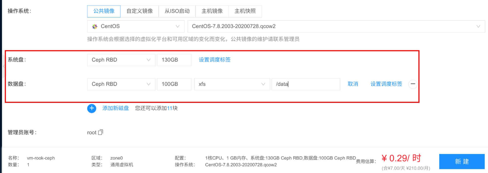
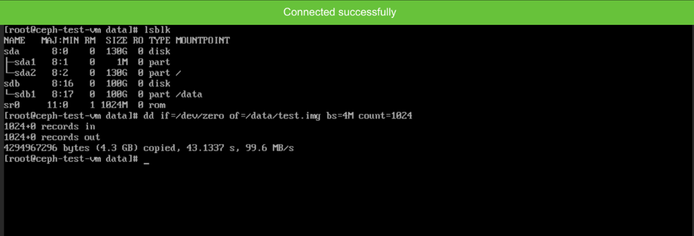

**作者:** 李泽玺

## 背景介绍

- [Cloudpods](https://www.cloudpods.org): 是我们开源的多云管理平台，运行在 Kubernetes 之上，里面包含一个完整的私有云实现。
- [Rook](https://rook.io/docs/rook/v1.7): 是一个分布式存储编排系统，目的是在 Kubernetes 上提供存储解决方案，本身不提供存储，而是在 Kubernetes 和存储系统之间提供适配层，简化存储系统的部署和维护工作。其支持的 Ceph 存储为 Stable 生产可用的状态。
- [Ceph](https://docs.ceph.com/): 是开源的分布式存储系统，主要功能包含 RBD 块存储以及 CephFS 分布式文件系统存储。

Cloudpods 服务以容器化的方式运行在 Kubernetes 集群之上，按照 [部署文档/多节点安装](/zh/docs/quickstart/nodes/) 文档部署完 Cloudpods 之后，环境就有了一个完整的 Kubernetes 集群。
但 Cloudpods 内置私有云虚拟机使用的是本地存储，本文主要介绍使用 Rook 在 Cloudpods Kubernetes 集群里面部署 Ceph 集群，然后把 Ceph 集群暴露出来对接 Cloudpods 的私有云虚拟机，实现一个云原生的超融合私有云。

## 环境准备

- Cloudpods：v3.6 以上的版本
- Kubernetes：v1.15.9 版本(Cloudpods 默认的集群)
- Rook: v1.7 版本
- 操作系统：CentOS 7
- 内核版本：3.10.0-1062.4.3.el7.yn20191203.x86_64
    - 如果使用 CephFS 建议的内核版本是 4.17 以上的版本，可以升级我们官方提供的 5.4 版本内核
- 3 台机器作为存储节点，有单独的裸盘给 Ceph 使用

其中 Ceph 相关的环境准备工作和限制可以参考 Rook 提供的文档：[https://rook.io/docs/rook/v1.7/pre-reqs.html](https://rook.io/docs/rook/v1.7/pre-reqs.html) 。

## 使用 Rook 部署 Ceph

接下来介绍使用 Rook 在已有的 Kubernetes 集群上部署 Ceph 集群，首先我们需要把准备好的 3 个存储节点加入到 Kubernetes 集群。

### 存储节点加入 Kubernetes 集群

准备的3个存储节点为 storage-node-{0,1,2}，每个存储节点的磁盘信息为：

```bash
$ lsblk
NAME   MAJ:MIN RM   SIZE RO TYPE MOUNTPOINT
sda      8:0    0 931.5G  0 disk
├─sda1   8:1    0     1M  0 part
├─sda2   8:2    0   512M  0 part /boot
└─sda3   8:3    0   931G  0 part /
sdb      8:16   0 931.5G  0 disk
sdc      8:32   0   3.7T  0 disk
sdd      8:48   0   3.7T  0 disk
```

然后可以参考文档[添加K8s节点](https://www.cloudpods.org/zh/docs/setup/components/)把节点都添加到已有的 Kubernetes 集群中。

添加完成后，使用 `kubectl get nodes` 可以看到对应的节点：

```bash
$ kubectl get nodes
kubectl get nodes
NAME              STATUS   ROLES    AGE   VERSION
cloudbox          Ready    master   34d   v1.15.9-beta.0
storage-node-0    Ready    <none>   12d   v1.15.9-beta.0
storage-node-1    Ready    <none>   11d   v1.15.9-beta.0
storage-node-2    Ready    <none>   11d   v1.15.9-beta.0
```

然后给对应的节点打上 role=storage-node 的标签：

```bash
# 打标签
$ kubectl label node storage-node-0 role=storage-node
$ kubectl label node storage-node-1 role=storage-node
$ kubectl label node storage-node-2 role=storage-node

# 查看
$ kubectl get nodes -L role
NAME               STATUS   ROLES    AGE   VERSION          ROLE
cloudbox           Ready    master   34d   v1.15.9-beta.0
storage-node-0     Ready    <none>   12d   v1.15.9-beta.0   storage-node
storage-node-1     Ready    <none>   11d   v1.15.9-beta.0   storage-node
storage-node-2     Ready    <none>   11d   v1.15.9-beta.0   storage-node
```

### 部署 Rook 组件

下载 Rook 相关代码：

```bash
# clone rook 源码
$ git clone --single-branch --branch release-1.7 https://github.com/rook/rook.git
$ cd rook
```

部署 rook operator 服务：

```bash
# apply rook 相关 CRD
$ cd cluster/examples/kubernetes/ceph/pre-k8s-1.16/
$ kubectl apply -f crds.yaml

# apply rook operator 服务
$ cd ..
$ kubectl apply -f common.yaml -f operator.yaml

# 查看 operator 服务的状态，等待 rook-ceph-operator pod 变为 Running
$ kubectl -n rook-ceph get pods
NAME                                  READY   STATUS    RESTARTS   AGE
rook-ceph-operator-68964f4b87-pc87m   1/1     Running   0          7m38s
```

### 创建 ceph 集群

首先根据自己的环境，修改 rook 提供的 `cluster.yaml` 里面的内容：

```bash
$ cp cluster.yaml cluster-env.yaml
```

下面是修改后的 cluster.yaml 和 cluster-env.yaml 的 diff 内容：

```bash
$ diff -u cluster.yaml cluster-env.yaml
```

请根据自己的节点环境配置，参考 diff 修改，需要注意的地方如下：

- spec.image: 改为 registry.cn-beijing.aliyuncs.com/yunionio/ceph:v14.2.22 ，这里需要用 v14 版本的镜像，对应的 ceph 版本为 nautilus，更高的版本可能会出现 cloudpods 不兼容的情况
- spec.network.provider: 改为 host ，表示 ceph 相关容器使用 hostNetwork ，这样才能给 Kubernetes 集群之外的服务使用
- spec.placement: 修改了里面的 Kubernetes 调度策略，表示把 ceph pod 调度到 role=storage-node 的节点上
- spec.storage: 表示存储的配置
    - useAllNodes: 我们指定了role=storage-node 的节点运行 ceph，该值必须设置为false
    - nodes: 分别设置各个节点的存储路径，可以是磁盘或者目录

```diff
--- cluster.yaml    2021-10-09 10:49:53.731596210 +0800
+++ cluster-env.yaml    2021-10-09 17:50:01.859112585 +0800
@@ -21,7 +21,7 @@
     # versions running within the cluster. See tags available at https://hub.docker.com/r/ceph/ceph/tags/.
     # If you want to be more precise, you can always use a timestamp tag such quay.io/ceph/ceph:v16.2.6-20210918
     # This tag might not contain a new Ceph version, just security fixes from the underlying operating system, which will reduce vulnerabilities
-    image: quay.io/ceph/ceph:v16.2.6
+    image: registry.cn-beijing.aliyuncs.com/yunionio/ceph:v14.2.22
     # Whether to allow unsupported versions of Ceph. Currently `nautilus`, `octopus`, and `pacific` are supported.
     # Future versions such as `pacific` would require this to be set to `true`.
     # Do not set to true in production.
@@ -81,7 +81,7 @@
     rulesNamespace: rook-ceph
   network:
     # enable host networking
-    #provider: host
+    provider: host
     # enable the Multus network provider
     #provider: multus
     #selectors:
@@ -135,22 +135,22 @@
   # To control where various services will be scheduled by kubernetes, use the placement configuration sections below.
   # The example under 'all' would have all services scheduled on kubernetes nodes labeled with 'role=storage-node' and
   # tolerate taints with a key of 'storage-node'.
-#  placement:
-#    all:
-#      nodeAffinity:
-#        requiredDuringSchedulingIgnoredDuringExecution:
-#          nodeSelectorTerms:
-#          - matchExpressions:
-#            - key: role
-#              operator: In
-#              values:
-#              - storage-node
-#      podAffinity:
-#      podAntiAffinity:
-#      topologySpreadConstraints:
-#      tolerations:
-#      - key: storage-node
-#        operator: Exists
+  placement:
+    all:
+      nodeAffinity:
+        requiredDuringSchedulingIgnoredDuringExecution:
+          nodeSelectorTerms:
+          - matchExpressions:
+            - key: role
+              operator: In
+              values:
+              - storage-node
+      podAffinity:
+      podAntiAffinity:
+      topologySpreadConstraints:
+      tolerations:
+      - key: storage-node
+        operator: Exists
 # The above placement information can also be specified for mon, osd, and mgr components
 #    mon:
 # Monitor deployments may contain an anti-affinity rule for avoiding monitor
@@ -207,8 +207,8 @@
 #    osd: rook-ceph-osd-priority-class
 #    mgr: rook-ceph-mgr-priority-class
   storage: # cluster level storage configuration and selection
-    useAllNodes: true
-    useAllDevices: true
+    useAllNodes: false
+    useAllDevices: false
     #deviceFilter:
     config:
       # crushRoot: "custom-root" # specify a non-default root label for the CRUSH map
@@ -219,17 +219,22 @@
       # encryptedDevice: "true" # the default value for this option is "false"
 # Individual nodes and their config can be specified as well, but 'useAllNodes' above must be set to false. Then, only the named
 # nodes below will be used as storage resources.  Each node's 'name' field should match their 'kubernetes.io/hostname' label.
-    # nodes:
-    #   - name: "172.17.4.201"
-    #     devices: # specific devices to use for storage can be specified for each node
-    #       - name: "sdb"
-    #       - name: "nvme01" # multiple osds can be created on high performance devices
-    #         config:
-    #           osdsPerDevice: "5"
-    #       - name: "/dev/disk/by-id/ata-ST4000DM004-XXXX" # devices can be specified using full udev paths
-    #     config: # configuration can be specified at the node level which overrides the cluster level config
-    #   - name: "172.17.4.301"
-    #     deviceFilter: "^sd."
+    nodes:
+      - name: "storage-node-0"
+        devices: # specific devices to use for storage can be specified for each node
+          - name: "sdb"
+          - name: "sdc"
+          - name: "sdd"
+      - name: "storage-node-1"
+        devices:
+          - name: "sdb"
+          - name: "sdc"
+          - name: "sdd"
+      - name: "storage-node-2"
+        devices:
+          - name: "sdb"
+          - name: "sdc"
+          - name: "sdd"
     # when onlyApplyOSDPlacement is false, will merge both placement.All() and placement.osd
     onlyApplyOSDPlacement: false
   # The section for configuring management of daemon disruptions during upgrade or fencing.
```

编辑好 `cluster-env.yaml` 后，使用下面的命令创建 ceph 集群：

```bash
$ kubectl apply -f cluster-env.yaml
cephcluster.ceph.rook.io/rook-ceph created

# 查看 rook-ceph namespace 里面的 pod 健康状况
$ kubectl -n rook-ceph get pods
NAME                                                 READY   STATUS      RESTARTS   AGE
rook-ceph-crashcollector-dl380p-55f6cc56c9-b8ghc     1/1     Running     0          3m3s
rook-ceph-crashcollector-r710-7d8659858-mrqgq        1/1     Running     0          2m20s
rook-ceph-crashcollector-r720xd-1-5b686487c5-hvzdb   1/1     Running     0          3m10s
rook-ceph-csi-detect-version-ffdsf                   0/1     Completed   0          26m
rook-ceph-mgr-a-759465b6c7-cslkp                     1/1     Running     0          3m13s
rook-ceph-mon-a-657c4c6769-ljtr9                     1/1     Running     0          18m
rook-ceph-mon-b-7db98b99d4-99pft                     1/1     Running     0          18m
rook-ceph-mon-c-7f84fc475d-5v599                     1/1     Running     0          10m
rook-ceph-operator-68964f4b87-pc87m                  1/1     Running     0          68m
rook-ceph-osd-0-7cc5cb94cb-dxznm                     1/1     Running     0          2m32s
rook-ceph-osd-1-f4d47ddf9-7vgh7                      1/1     Running     0          2m35s
rook-ceph-osd-2-5d7667b8d8-d5tnp                     1/1     Running     0          2m20s
rook-ceph-osd-3-c9c56cd77-8sbzj                      1/1     Running     0          2m32s
rook-ceph-osd-4-88565589c-rnpmg                      1/1     Running     0          2m35s
rook-ceph-osd-5-7d7c554b6c-pvsfx                     1/1     Running     0          2m35s
rook-ceph-osd-6-6c7596c844-jg9qt                     1/1     Running     0          2m20s
rook-ceph-osd-7-55f9987ddf-pjthz                     1/1     Running     0          2m32s
rook-ceph-osd-8-6949b69dd6-685wp                     1/1     Running     0          2m20s
rook-ceph-osd-prepare-dl380p-c6nc8                   0/1     Completed   0          3m3s
rook-ceph-osd-prepare-r710-zkmjz                     0/1     Completed   0          3m3s
rook-ceph-osd-prepare-r720xd-1-fswnf                 0/1     Completed   0          3m2s

# 查看 ceph 集群的健康状况
$ kubectl -n rook-ceph get cephcluster
NAME        DATADIRHOSTPATH   MONCOUNT   AGE   PHASE   MESSAGE                        HEALTH
rook-ceph   /var/lib/rook     3          29m   Ready   Cluster created successfully   HEALTH_OK
```

ceph 集群部署完后，我们需要部署 `toolbox.yaml` pod 获取集群连接信息：

```bash
$ kubectl apply -f toolbox.yaml
deployment.apps/rook-ceph-tools created

$ kubectl -n rook-ceph get pods | grep tools
rook-ceph-tools-885579f55-qpnhh                      1/1     Running     0          3m44s

# 进入 toolbox pod
$ kubectl -n rook-ceph exec -it $(kubectl -n rook-ceph get pod -l "app=rook-ceph-tools" -o jsonpath='{.items[0].metadata.name}') -- bash
# 查看 mon_host 为: 172.16.254.126:6789,172.16.254.124:6789,172.16.254.127:6789
[root@rook-ceph-tools-885579f55-qpnhh /]$ cat /etc/ceph/ceph.conf
[global]
mon_host = 172.16.254.126:6789,172.16.254.124:6789,172.16.254.127:6789

[client.admin]
keyring = /etc/ceph/keyring

# 查看 keyring 为: AQBHTWFhFQzrORAALLIngo/OOTDdnUf4vNPRoA==
[root@rook-ceph-tools-885579f55-qpnhh /]$ cat /etc/ceph/keyring
[client.admin]
key = AQBHTWFhFQzrORAALLIngo/OOTDdnUf4vNPRoA==

# 查看集群健康状态
[root@rook-ceph-tools-885579f55-qpnhh /]$ ceph status
  cluster:
    id:     233cf123-7a1a-4a7b-b6db-1cee79ec752b
    health: HEALTH_OK

  services:
    mon: 3 daemons, quorum a,b,c (age 38m)
    mgr: a(active, since 33m)
    osd: 9 osds: 9 up (since 33m), 9 in (since 34m); 30 remapped pgs

  data:
    pools:   1 pools, 256 pgs
    objects: 0 objects, 0 B
    usage:   57 MiB used, 20 TiB / 20 TiB avail
    pgs:     226 active+clean
             30  active+clean+remapped

# 查看 osd 状态，可以发现对应节点的设备都添加了进来
[root@rook-ceph-tools-885579f55-qpnhh /]$ ceph osd status
ID  HOST            USED  AVAIL  WR OPS  WR DATA  RD OPS  RD DATA  STATE
 0  storage-node-0  6172k  3725G      0        0       0        0   exists,up
 1  storage-node-1  7836k   279G      0        0       0        0   exists,up
 2  storage-node-2  5596k   931G      0        0       0        0   exists,up
 3  storage-node-0  6044k  3725G      0        0       0        0   exists,up
 4  storage-node-1  5980k   279G      0        0       0        0   exists,up
 5  storage-node-1  5980k   279G      0        0       0        0   exists,up
 6  storage-node-2  6236k  3726G      0        0       0        0   exists,up
 7  storage-node-0  7772k  3725G      0        0       0        0   exists,up
 8  storage-node-2  7836k  3726G      0        0       0        0   exists,up

# 创建一个 cloudpods-test 的 pool 用于后面的虚拟机测试
[root@rook-ceph-tools-885579f55-qpnhh /]$ ceph osd pool create cloudpods-test 64 64
pool 'cloudpods-test' created

# 初始化这个pool 为 RBD
[root@rook-ceph-tools-885579f55-qpnhh /]$ rbd pool init cloudpods-test

[root@rook-ceph-tools-885579f55-qpnhh /]$ ceph osd lspools
1 cloudpods-test
```

## Cloudpods 虚拟机使用 Rook 部署的 Ceph

通过之前的步骤，已经使用 Rook 在 Kubernetes 集群里面部署了 Ceph 集群，接下来将 Ceph 集群的连接信息导入到 Cloudpods 私有云平台，就可以给虚拟机使用了。

从之前的步骤得到 ceph 的连接信息如下：

- mon_host: 172.16.254.126:6789,172.16.254.124:6789,172.16.254.127:6789
- keyring: AQBHTWFhFQzrORAALLIngo/OOTDdnUf4vNPRoA==
- rbd pool: cloudpods-test

然后登录 cloudpods 前端创建 ceph rbd 存储并且关联宿主机，操作如下：

1. 创建名为 rook-ceph 的块存储，填入上面的信息：



2. 默认创建好的 rook-ceph 块存储为离线状态，需要关联平台的私有云宿主机，宿主机会探测 ceph 集群的连通性，并且获取对应的 pool 容量信息：



3. rook-ceph 块存储关联好宿主机后，状态就会变为“在线”，并且获取到了 20T 的容量：



4. 创建虚拟机使用 `rook-ceph` 存储，这里主要是在虚拟机创建页面添加磁盘，选择存储类型为 **Ceph RBD**：



5. 等待虚拟机创建完成，通过 vnc 或者 ssh 登录虚拟机：



可以发现虚拟机里面挂载了 /dev/sda(系统盘) 和 /dev/sdb(数据盘)，底层都为 ceph 的 RBD 块设备，因为 ceph 底层块设备用的机械盘，用 dd 简单测试速度在 99 MB/s ，符合预期。

## 其它操作

- 删除 Rook 部署的 Ceph 集群请参考：[Cleaning up a Cluster](https://rook.io/docs/rook/v1.7/ceph-teardown.html)
