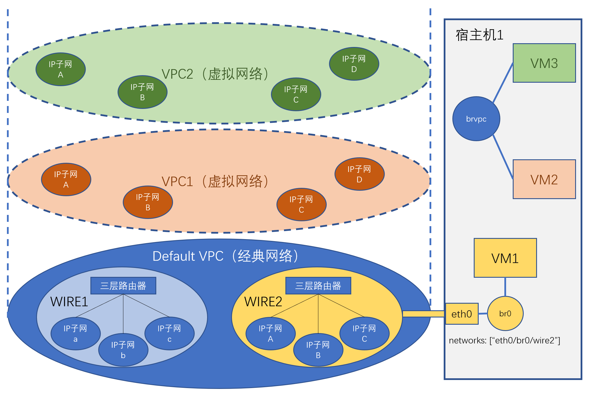

## 概念

Cloudpods网络中有几个重要概念，一个是地理范围的概念，Region与Zone，另外一组概念是网络架构的概念，也就是VPC，Wire和Network。

### Region与Zone

- **Region（区域）** 是一个Cloudpods部署实例覆盖的地理范围，通常是一个城市。一个Cloudpods实例只能管理一个区域。

- **Zone（可用区）** 是一个区域内的一个子区域。可用区顾名思义就是可用性独立的区域，也就是拥有独立的风火水电和网络供应的区域。通常是一个IDC的一个机房。一个Cloudpods实例可以管理若干个可用区。

下面介绍Cloudpods网络中的三个重要概念：VPC, Wire（二层网络）和Network（IP子网）。

### VPC

Cloudpods给计算资源提供两种模式的网络：经典网络和VPC网络。

- **经典网络**，又叫**扁平网络**，也可以理解为underlay网络，是完全由硬件设备来承载网络报文的转发，没有采用网络虚拟化。所以扁平网络受限于物理网络拓扑，必须和物理网络拓扑匹配。网络报文的转发采用物理网络设备，是硬件交换。KVM虚拟机，裸金属和VMware虚拟机都能使用经典网络。

- **VPC网络**，又叫**虚拟网络**，就是overlay网络，是基于SDN技术，在underlay网络上虚拟出的虚拟网络，网络报文采用隧道封装，可以构造任意的网络拓扑。网络报文的转发由虚拟的交换机和网络设备转发，是软件交换。目前，只有KVM虚拟机可以使用VPC网络。

Cloudpods的私有云平台支持经典网络。云平台的经典网络与数据中心的基础设施网络之间是同级关系，因此，使用经典网络的一个优势是虚机与基础设施其它部分的互连互通相对简便。另外，使用经典网络时，在实施前需要做好网段规划，一方面避免与已有地址段重叠，一方面留足余量用于扩容。在具体的实施阶段，可能需要在物理的交换机、路由器上为经典网络配置网关等参数。

从3.1版本开始，Cloudpods开始支持VPC网络。VPC是Virtual Private Cloud（虚拟私有云）的缩写，也叫“虚拟专用网络”，在同一套网络基础设施上可以虚拟出多个VPC网络。VPC之间、VPC与基础设施网络之间是相互隔离的，可以有各自的地址分配空间，配置各自的网关、路由等。由于这种相互隔离的特点，VPC的使用非常敏捷，增删非常容易。如果仅是一个个隔离的网络孤岛，VPC的用途是受限的，我们可以通过部署EIP网关，让VPC可以与外界互通。

上面提到了经典网络与其它VPC是相互隔离的，Cloudpods平台在实际处理时把经典网络也当作一个特殊的VPC看待。在系统初始化时，平台会创建一个ID为`default`名称为`Default`的VPC表示经典网络。

Default VPC代表的是一个区域内的经典网络（Underlay）。其他的VPC则代表一个区域内的虚拟网络。VPC和VPC之间相互隔离。VPC是区域资源。一个区域内可以有多个VPC，一个VPC可以跨多个可用区，但不能跨多个区域。

### Wire和Network

在经典网络中，网络被三层网路设备分割为不同的广播域，每个广播域是一个联通的二层网络。Wire被用来描述这个概念，因此Wire被翻译为广播域或二层子网。一个Wire内可以配置多个IP子网（Network），每个IP子网可以有不同的网络地址和子网掩码，但是地址空间不能重叠。Wire内的节点之间二层互通，但是不同的节点可以被划分到不同的IP子网。属于相同网络地址和子网掩码的节点之间可以直接通信，否则需要通过三层网络设备通过IP路由来通信。经典网络中，由于不同可用区的网络是独立的，因此一个Wire不会跨可用区，只能归属于一个可用区。我们用一台宿主机或物理机和Wire的对接关系来描述一台宿主机或物理机的网络连通性约束。当一台宿主机的一个网口和一个Wire对接，则说明这台宿主机的这个网口，以及跟通过这个网络桥接的虚拟机的网口都可以分配归属于这个Wire的所有IP子网的IP地址。

在VPC网络中，节点之间的互通并不受到任何物理约束，可以实现任意节点之间的二层通信。因此，Wire的概念在VPC网络中没有太大意义。但是，为了保持和经典网络统一的概念和模型关系，我们还是在VPC网络中，VPC和IP子网之间虚拟出一个Wire来。在每个可用区，为每个VPC创建一个Wire，用来容纳该VPC在此可用区内的IP子网。可以理解为，这个Wire更多是给VPC内的IP子网提供了可用区的约束。

如图所示，宿主机1通过物理网口eth0和二层网络WIRE2对接，则该宿主机上分配经典网络的IP子网必须归属于WIRE2。这是物理网络拓扑施加的约束，无法逾越。同时，该宿主机上的虚拟机也可以接入VPC网络，则该宿主机可以接入其所在Region的任意VPC网阔，并且该宿主机上的虚拟机可以分配对应VPC里的任意IP子网的IP地址。

从模型设计上，VPC与二层网络是一对多的关系。具体来说，经典网络VPC可以对应多个二层网络，例如，经典网络中可以有管理网、业务网等二层网络的划分。对于普通VPC来说，通常一个可用区对应一个二层网络，这个二层网络更多是为了保持核经典网络在模型上的统一，因此在使用VPC时通常不将二层网络考虑在内。

二层网络与子网的关系。二层网络是子网的属性，一个二层网络中可以有多个子网。

	      1:n           1:n
	VPC -------> Wire -------> Network