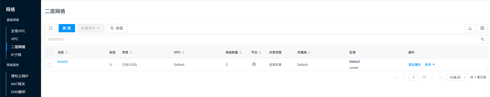
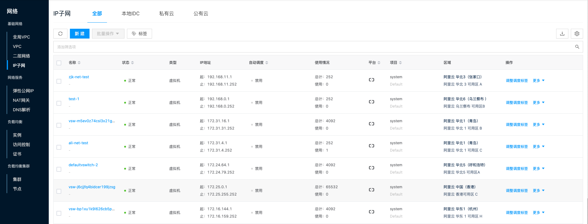

平台内置私有云默认将自动生成的Default VPC作为经典网络，在Default VPC下创建的二层网络或IP子网都与实际环境相关，

**二层网络入口**：在云管平台单击左上角导航菜单，在弹出的左侧菜单栏中单击 **_"网络/基础网络/二层网络"_** 菜单项，进入二层网络页面。

  

**IP子网入口**：在云管平台单击左上角导航菜单，在弹出的左侧菜单栏中单击 **_"网络/基础网络/IP子网"_** 或 **_"主机/网络/IP子网"_** 菜单项，进入IP子网页面。

