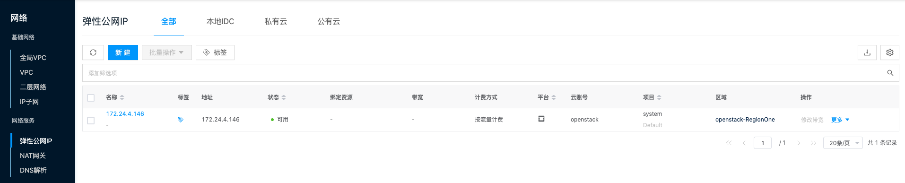

平台内置私有云提供VPC网络功能，并支持将经典网络的IP子网网段作为弹性公网IP池使用，供VPC内的虚拟机与外界访问等。

**VPC入口**：在云管平台单击左上角导航菜单，在弹出的左侧菜单栏中单击 **_"网络/基础网络/VPC"_** 菜单项，进入VPC页面。

**IP子网入口**：在云管平台单击左上角导航菜单，在弹出的左侧菜单栏中单击 **_"网络/基础网络/IP子网"_** 或 **_"主机/网络/IP子网"_** 菜单项，进入IP子网页面。

**弹性公网IP入口**：**入口**：在云管平台单击左上角导航菜单，在弹出的左侧菜单栏中单击 **_"网络/基础网络/弹性公网IP"_** 或 **_"主机/网络/弹性公网IP"_** 菜单项，进入弹性公网IP页面。

