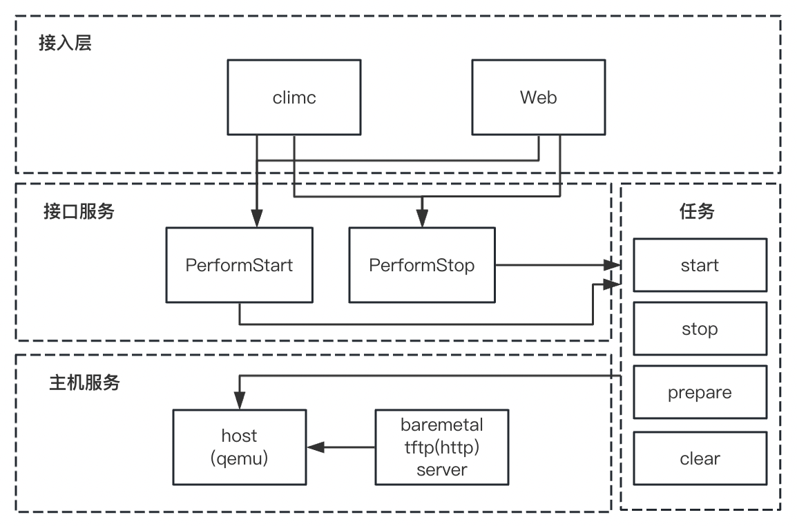

## 救援模式的服务开发流程简介

在救援系统的开发中，需要从接入层面（climc/web），以及业务逻辑上进行开发，整体上涉及到的模块如下：

### 整体结构



### 接入层

根据[后端服务框架](https://www.cloudpods.org/zh/docs/development/framework/#)，可以了解到接入层的开发方式，接入层主要是对接用户的请求，然后将请求转发到后端服务，同时交互的方式主要以HTTP Restful API为主。

#### climc

climc提供了人性化的命令提示和注释功能，可以通过`climc xxx`的方式，方便地调用或者调试接口的功能。

添加自己的climc命令时，需要在`cmd/climc/shell`中添加命令的参数和调用逻辑，使用`R`函数包装之后，命令会添加到`CommandTable`中并交付给climc调用。

在具体实现中，以启动救援模式为例：

```golang
// ServerStartRescueOptions is used to start a rescue os.
type ServerStartRescueOptions struct {
  ID          string `help:"ID of server" json:"-"`
  QemuVersion string `help:"prefer qemu version" json:"qemu_version"`
}
```

首先配置该命令的参数配置，然后在`R`函数中提供调用的逻辑和提示信息。
```golang
R(&ServerStartRescueOptions{}, "server-start-rescue ", "Start rescu e a guest server", func(s *mcclient.ClientSession, opts *ServerStartRescueOptions) error {
  params, err := baseoptions.StructToParams(opts)
  if err != nil {
    return err
  }

  result, err := modules.Servers.PerformAction(s, opts.ID, "start-rescue", params)
  if err != nil {
    return err
  }

  printObject(result)

  return nil
})
```

这里调用的`PerformAction`会访问`Perform`前缀的方法，并由`Model Dispatcher`和`Model`解析，并且分发到对应模块对应的业务操作中。

### Compute服务

前文中提到了[后端服务框架](https://www.cloudpods.org/zh/docs/development/framework/#)，可以简单概括为使用`SModel`来获取数据库某条记录的操作，使用`SModelManager`来获取数据库中整张表的操作（Model指的是对应的资源，例如Guest）。此外，根据` pkg/appsrv/dispatcher/dispatcher.go`以及[Model Dispatcher](https://www.cloudpods.org/zh/docs/development/framework/#model-dispatcher)中的绑定规则，可以在对应服务资源下完成操作。

在实际实现中，以启动救援模式为例：

```golang
func (self *SGuest) PerformStartRescue(ctx context.Context, userCred mcclient.TokenCredential, query jsonutils.JSONObject,
	data jsonutils.JSONObject) (jsonutils.JSONObject, error) {
  ...
}
```

使用`Perform`前缀修饰方法，在`Model Dispatcher`中会通过反射获取http的请求对应的的方法，然后将请求的参数和数据传递给该方法，然后在该方法中完成对应的业务逻辑，包括获取`baremetal`控制节点信息，参数校验，然后启动一个`Task`将耗时任务放到Task调度器中，等待后续的执行。

### Task服务

在解析请求并且完成服务操作流程后，针对该请求中耗时的任务，cloudpods提供了Task机制保证请求的及时响应。会通过更新虚拟机 SGuest model 的状态和记录操作日志来表示执行的成功或失败。

在Task启动后，会通过Task调度器在`STaskManager`库表中新增一条记录，并且通过`SetStage`设置Task的执行阶段，默认从`OnInit`开始执行，当调用失败后会通过`XXXFailed`的方法完成失败回调，或者调用`XXXComplete`的方法完成成功回调，或进入下一阶段。

在具体实现中，以启动救援模式为例：

```golang
type StartRescueTask struct {
	SGuestBaseTask
}

func init() {
	taskman.RegisterTask(StartRescueTask{})
}

func (self *StartRescueTask) OnInit(ctx context.Context, obj db.IStandaloneModel, data jsonutils.JSONObject) {
  ...
}
```

需要在新建一个Task的对象，这里是`StartRescueTask`，并且在golang语法糖`init`方法中将该结构体（库表）注册到`SWorkerManager`中。

```golang
func (self *StartRescueTask) StopServer(ctx context.Context, guest *models.SGuest) {
  ...
}

func (self *StartRescueTask) OnServerStopComplete(ctx context.Context, guest *models.SGuest, data jsonutils.JSONObject) {
  ...
}

func (self *StartRescueTask) OnServerStopCompleteFailed(ctx context.Context, guest *models.SGuest, err jsonutils.JSONObject) {
  ...
}
```

然后编写对应的执行方法，这里是`StopServer`，并且在`OnXXXComplete`和`OnXXXFailed`中完成成功和失败的回调。

### Host/Baremetal服务

在[服务组件介绍](https://www.cloudpods.org/zh/docs/development/services/)中，描述了关于`host`（私有云虚拟机管理）和`baremetal`（私有云物理机管理）的服务。在host中，提供了详细的`qemu-kvm`的封装操作，执行虚拟机侧的操作，例如启动虚拟机，停止虚拟机，获取虚拟机的状态，创建磁盘，网卡等。

在`host`服务中，类似前面的`compute`服务，也提供了`Model Dispatcher`的请求分发能力，具体的绑定和实现在`pkg/hostman/guestman/guesthandlers/guesthandler.go`中`AddGuestTaskHandler`，可以针对上层请求访问到具体功能。其余开发流程和`Compute`类似。

在具体实现中，以启动救援模式为例：

```golang
func AddGuestTaskHandler(prefix string, app *appsrv.Application) {
  ...

  for action, f := range map[string]actionFunc{
    ...
    "start-rescue":             guestStartRescue,
    ...
  }
}
```

在Handler中添加对应的请求路径和和处理方法，这里是`guestStartRescue`。

然后通过Task机制，从Baremetal中下载启动救援模式需要的`initramfs/kernel`，`Baremetal-agent`中提供了一个`tftp`服务，并且封装成为`http`以供下载，可以直接通过`endpoint` + `filename`的形式下载。

此外，在虚拟机启动/创建时，`host`服务会在`/opt/cloud/workspace/servers`下面新建一个虚拟机描述文件`desc`，并且通过`SaveSourceDesc`将描述的文件信息保存到对应目录下，以便于重启和手动测试使用上次启动状态重启。

该描述文件对应到`pkg/hostman/guestman/desc/desc.go`中，在对应`Desc`添加关于虚拟机救援模式启动的描述配置。

### Web端添加控制入口

cloudpods同时提供了一个丰富的web界面以供可视化操作和监控配置，仓库地址为[dashboard](https://github.com/yunionio/dashboard)，项目使用`vue`开发，可以参考[前端代码结构](https://www.cloudpods.org/zh/docs/development/codestruct/#%E5%89%8D%E7%AB%AF%E4%BB%A3%E7%A0%81%E7%BB%93%E6%9E%84)，可以使用`Chrome`的`Vue`插件定位到组件的位置，然后使用类似`climc`的请求方式完成数据的调用。

在具体实现中，以启动救援模式为例：

```javascript
// containers/Compute/views/vminstance/constants/actions.js
{
  label: i18n.t('compute.start_rescue'),
  permission: 'server_perform_start_rescue',
  action: () => {
    this.createDialog('VmStartRescueDialog', {
      data: [obj],
      columns: this.columns,
      onManager: this.onManager,
    })
  },
  meta: () => {
    return { validate: cloudEnabled('startRescue', obj) }
  },
  hidden: () => this.$isScopedPolicyMenuHidden('vminstance_hidden_menus.server_perform_start_rescue'),
},
```

添加组件对应的action，并且在methods中添加对应的接口访问，调用启动救援模式的接口。

```javascript
methods: {
  async doStartRescueSubmit () {
    const ids = this.params.data.map(item => item.id)
    return this.params.onManager('batchPerformAction', {
      id: ids,
      steadyStatus: 'running',
      managerArgs: {
        action: 'start-rescue',
      },
    })
  },
  async handleConfirm () {
    this.loading = true
    try {
      await this.doStartRescueSubmit()
      this.loading = false
      this.cancelDialog()
    } catch (error) {
      this.loading = false
    }
  },
},
```

在权限部分，找到`src/constants/permission.js`，添加服务的权限和组件位置，这里是`server_perform_start_rescue`。
最后是前端界面的国际化，在`src/locales/*.json`中添加对应语言的翻译，使用`t`函数翻译为对应的语言。

### 容器测试服务

在救援模式的开发中，需要对救援模式的功能进行测试，cloudpods提供了k8s上面的容器管理，可以参考[镜像编译上传](https://www.cloudpods.org/zh/docs/development/dev-env/#docker-%E9%95%9C%E5%83%8F%E7%BC%96%E8%AF%91%E4%B8%8A%E4%BC%A0)完成本地测试文件的构建和新文件的启动。

在具体实现中，可以在[Aliyun](https://cn.aliyun.com/product/acr)服务中申请自己的镜像仓库，并且在`cloudpods`的根目录下使用`make`构建服务。并且参考[镜像发布流程](https://www.cloudpods.org/zh/docs/development/dev-env/#%E5%B0%86%E9%95%9C%E5%83%8F%E5%8F%91%E5%B8%83%E5%88%B0-kubernetes-%E9%9B%86%E7%BE%A4)完成测试容器的部署。

> 备注：region和host的服务类型不一样，更新镜像需要指定deployments/pods