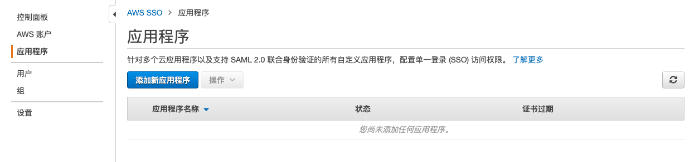
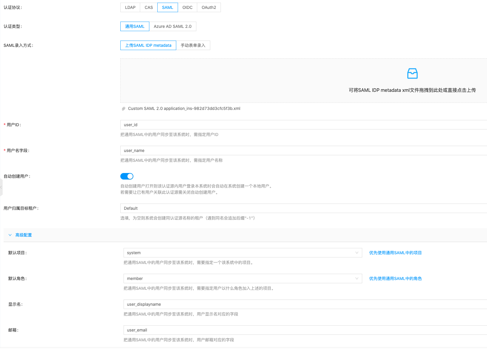
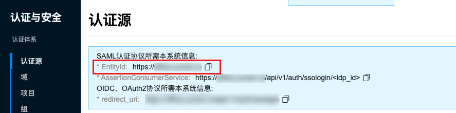
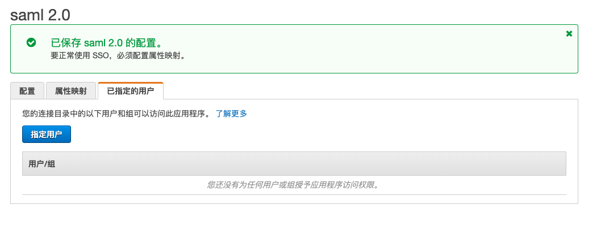
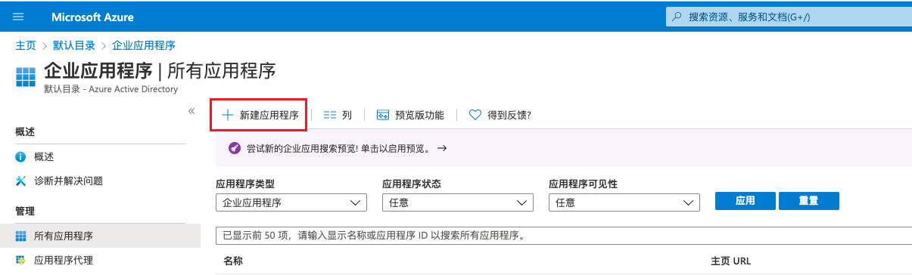

### 新建通用SAML认证源

#### 前提条件

以AWS SSO作为平台的SAML IDP。目前仅AWS国际区支持AWS SSO。

1. 在[AWS](https://console.aws.amazon.com/)平台搜索“AWS SSO”并进入“AWS Single Sign-On”页面。

    

2. 在AWS SSO-应用程序中添加新应用程序。

    

3. 选择 **_"添加自定义SAML 2.0 应用程序"_** ，进入“配置 Custom SAML 2.0 application” 页面。

    

4. 下载AWS SSO SAML元数据文件，该文件即为在平台配置通用SAML时所需的“SAML IDP metadata”的XML文件。

    

5. 在应用程序元数据中选择上传元数据文件或手动键入元数据值。
    - SAML元数据文件获取方式：
        - 在平台上新建认证源，认证协议选择“SAML”、认证类型选择“通用SAML”。
        - SAML录入方式选择“上传SAML IDP metadata”，上传在AWS下载的AWS SSO SAML元数据文件。
        - 用户ID、用户名：设置用户ID和用户名的用户属性，如user_id，user_name，同时需要在AWS的SAML应用程序的属性映射页签中，将应用程序的应用属性映射到AWS SSO中的用户属性。
        - 建议勾选“自动创建用户”，并选择用户所属的域、项目、角色等。
        

        - 创建完成后，在通用SAML的认证源详情中，下载IDP源数据，该文件即AWS配置SAML应用程序所需的元数据文件。
        

    - SAML元数据值获取方式：
        - 在平台的认证源页面，查看“SAML认证协议所需本系统信息”中的entity_id即为应用程序SAML受众。
        

        - 按照上面步骤新建通用SAML认证源，点击SAML认证源名称进入认证源详情页面，查看认证源配置信息中的AssertionURI即应用程序ACS URL。
        
        

5. 配置完成后，保存更改。
6. 在应用程序详情-属性映射中，配置以下信息，单击 **_"保存更改"_** 按钮。

    

7. 在应用程序详情-已指定的用户中，添加指定的用户和组，添加的用户可以通过AWS SAML访问应用程序。
    

#### 操作步骤

1. 在认证源页面，单击列表上方 **_"新建"_** 按钮，进入新建认证源页面。
2. 配置以下参数：
    - 认证源归属：设置认证源的归属范围，当认证源归属于系统时，即系统中所有用户都可以使用该认证源登录平台。当认证源归属于域时，只有该域中的用户可以使用该认证源登录平台。域管理后台下，认证源归属于域管理员所属域。
    - 名称：设置认证源的名称。
    - 备注：设置认证源的备注信息。
    - 认证协议：选择“SAML”。
    - 认证类型：支持通用SAML和Azure AD SAML2.0。不同类型支持的参数不同。
    - 选择认证类型为通用SAML。
        - 支持通过上传SAML IDP metedata文件或手动表单录入。
        - 用户ID：设置通用SAML中对应的用户ID属性。
        - 用户名：设置通用SAML中对应的用户名属性。
    - 用户归属目标域：勾选自动创建用户后才需要设置该参数。选择通过该认证方式登录自动创建的用户所属的域，当认证源归属于域时，用户归属目标域与认证源归属域一致，不可更改。

    **高级配置**：默认隐藏，可根据需求进行配置。

    - 默认项目：设置通过SAML认证协议的认证源登录并在平台自动创建的用户加入的默认项目。
    - 默认角色：设置通过SAML认证协议的认证源登录并在平台自动创建的用户加入的默认角色。

### 新建Azure AD SAML2.0认证源

#### 前提条件

只支持Azure全球区的账号。

1. 用户登录[Azure](https://portal.azure.com)。
2. 在 **_"Azure Active Directory-企业应用程序-所有应用程序"_** 中新建应用程序。

    

3. 单击 **_"创建你自己的应用程序"_** 后，在弹出的对话框中设置应用名称，选择 **_"集成库中未发现的任何其他应用程序"_** ，单击 **_"创建"_** 按钮。

    

4. 创建成功后进入应用程序详情后，在单一登录页面，选择 **_"SAML"_** 。
    
    

5. 在设置SAML单一登录页面配置标识符ID和回复URL。

    
{}
在平台认证源页面可查看平台的回调地址以及标识符ID。
{}

6. 在应用程序详情 - 用户和组页面，单击 **_"添加用户/组"_** 按钮，进入添加分配页面。

    

7. 选择对应用户后，单击 **_"分配"_** 按钮，将需要通过Azure SAML 认证源登录平台的用户添加到应用程序。

    
    
8. 在Azure Active Directory-概述页面，可以获取到TenantID（租户ID）。

    

#### 操作步骤

1. 在认证源页面，单击列表上方 **_"新建"_** 按钮，进入新建认证源页面。
2. 配置以下参数：
    - 认证源归属：设置认证源的归属范围，当认证源归属于系统时，即系统中所有用户都可以使用该认证源登录平台。当认证源归属于域时，只有该域中的用户可以使用该认证源登录平台。域管理后台下，认证源归属于域管理员所属域。
    - 名称：认证源的名称。
    - 认证协议：选择“SAML”。
    - 认证类型：支持通用SAML和Azure AD SAML2.0。不同类型支持的参数不同。
    - 当认证类型为Azure AD SAML2.0时仅需要配置TenantId。
    - 用户归属目标域：勾选自动创建用户后才需要设置该参数。选择通过该认证方式登录自动创建的用户所属的域，当认证源归属于域时，用户归属目标域与认证源归属域一致，不可更改。

    **高级配置**：默认隐藏，可根据需求进行配置。

    - 默认项目：设置通过SAML认证协议的认证源登录并在平台自动创建的用户加入的默认项目。
    - 默认角色：设置通过SAML认证协议的认证源登录并在平台自动创建的用户加入的默认角色。