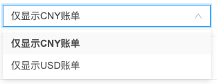

建议列表将显示出所有匹配规则的资源信息。

{}
默认情况下，当环境中存在多币种账单时，将会出现切换币种下拉框。如下图所示

- 当值为“仅显示CNY账单”时，则建议列表里只包含账单币种为CNY的资源信息。
- 当值为“仅显示USD账单”时，则建议列表里只包含账单币种为CNY的资源信息。
{}

1. 在左侧导航栏，选择 **_"优化建议/成本优化/建议列表"_** 菜单项，进入建议列表页面。
2. 查看以下信息：
    - 资源名称：资源的名称。
    - 状态：建议列表中资源的处理状态。
    - 规则：建议列表中的资源匹配的优化建议规则。
    - 优化建议：推荐对资源进行的优化建议。
    - 每月可节约：处理该资源后每月可节省的费用，支持根据金额进行排序。
    - 每年可节约：处理该资源后每年可节省的费用，支持根据金额进行排序。
    - 平台：资源所属的平台。
    - 项目：资源所属项目。
    - 区域：资源所属区域。