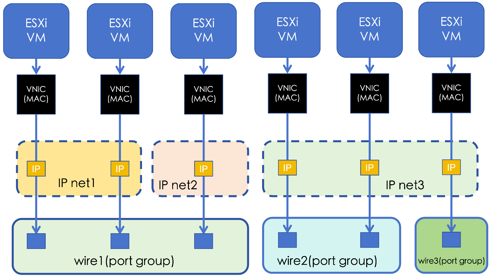

VMware是一个虚拟化平台，只提供二层网络交换的功能，不具备完整的网络管理能力。 为VMware补足网络管理的能力，提供IP地址和网络配置信息管理的能力。

## 基本概念

VMware中有以下基本网络概念：

### 标准虚拟交换机 (Standard vSwitch)

每台ESXi宿主机内可以配置多个虚拟交换机，实现虚拟机之间以及虚拟机和外部物理网络的网络交换。

### 分布式虚拟交换机（Distributed vSwitch）

被vCenter纳管的多台宿主机之间可以定义共享的分布式虚拟交换机，实现跨ESXi宿主机的虚拟机之间的统一配置的二层网络交换。

### 端口(Port)

虚拟机接入虚拟交换机的虚拟网络端口。

### 标准端口组 (Standard Port Group)

标准虚拟机交换机上的一组虚拟端口，共享相同的VLAN，安全策略，冗余等配置。

### 分布式端口组（Distributed Port Group）

分布式虚拟交换机上的一组虚拟端口。

## 基本原理

3.10以及之前版本，VMware中的虚拟交换机和的二层网络一一对应。IP子网和分布式端口组对应。IP子网和分布式端口组通过VLAN ID关联。这种映射方式比较隐晦，不容易配置。

从3.11开始，VMware中的端口组和 的二层网络一一对应。VMware不负责IP子网的信息维护，因此，每个端口组上可以分配的IP子网信息在  中维护。

下面总结了VMware相关概念和  相关概念的关联关系。

| VMware概念          |  概念 |    如何关联          |  关联关系      |
|--------------------|---------------------|--------------------|---------------|
| 虚拟机              | 虚拟机               | 通过虚拟机UUID关联    | 一对一         |
| ESXi主机            | 宿主机               | 通过主机管理IP管理    | 一对一         |
| 端口（port）        | 虚拟网卡              | 通过IP地址和MAC关联   | 一对一         |
| 端口组（portgroup） | 二层网络              | 通过端口组的ID关联     | 一对一         |
| 无                 | IP子网               | NA                  | NA            |



纳管 VMware 云账号时，平台会同步端口组的信息，并自动为每个端口组创建一个一一对应的二层网络。因VMware不负责虚拟机的IP地址管理，因此同步后二层网络上的IP子网信息需要管理员在上维护。

## VMware IP子网的维护

平台虚拟机的虚拟网卡包含如下四个信息：关联的虚拟机，对接的IP子网，虚拟网卡的IP地址和MAC地址。因为VMware不负责维护IP子网的信息，因此纳管VMware云账号后，我们只能获知每台虚拟机对接的虚拟网卡的MAC地址，对接的端口组（以及对应的二层网络）。更进一步地，如果VMware虚拟机内安装并运行版本匹配的VMware Tools软件，则VMware平台也能通过VMware tools获得虚拟机内配置的IP地址。但因为IP子网信息的缺失，导致刚纳管后的VMware虚拟机都没有虚拟网卡的记录。为了方便用户使用，如果虚拟机的IP地址可以通过VMware Tools获取，则会把该IP地址信息记录在虚拟机的标签上，但这仅仅是做了一个标记。为了纳管的VMware虚拟机有虚拟网卡的记录，需要在平台创建合适的IP子网。

IP子网需要创建在二层网络之上。在一个VMware二层网络上创建的IP子网应该包含该二层网络对应的端口组对接的虚拟机的IP地址。因此，为了维护IP子网的方便，建议一个IP子网的网段只在一个VMware端口组内使用。

创建好IP子网后，再次同步VMware云账号，对于可以探测到IP地址的VMware虚拟机，平台会根据其IP地址查找到对应二层网络上的IP子网，并创建对应的虚拟网卡记录。对于无法探测到IP地址的VMware虚拟机，平台无法自动创建对应的虚拟网卡。此时，用户可以通过修正IP地址的接口，手动指定该虚拟机的IP地址。平台会根据该IP地址，找到虚拟机所在端口组对应的二层网络上的IP子网，创建对应的虚拟网卡记录，把这个IP地址占住。

平台默认支持一个IP子网仅归属于一个二层网络，但是在实际使用场景中，存在一段连续的IP地址段被分散在多个端口组的虚拟机使用的情况。此时，管理员在创建IP子网时，需要先指定一个默认的二层网络。创建时，平台会自动检测该IP子网是否还被其他VMware二层网络（上的虚拟机）使用。如果存在，则会自动将对应二层网络设置为该IP子网的附属二层网络。创建后，管理员还可以手动地为该IP子网设置附属二层网络。一台归属于一个IP子网的附属二层网络的虚拟机也可以使用该IP子网的IP。

## VMware新建主机的IP地址分配

在  中创建VMware虚拟机时，平台会自动从虚拟机对接的IP子网中为虚拟机分配一个IP地址，同时根据IP子网和二层网络（端口组）以及宿主机的关联关系，将虚拟机分配到可以使用该IP子网的宿主机上。在VMware平台创建该虚拟机时，平台会在VMware中的ESXi宿主机上找到一个跟该IP子网对应的端口组（如果有多个，则选择其中一个）为虚拟机分配一个端口，并且将该虚拟机的虚拟网卡和该端口组关联。在部署配置阶段，在虚拟机内部署上该网卡对应的网络配置，包括IP地址，子网掩码，网关，DNS等配置信息。虚拟机启动后，该虚拟网卡即自动配置好，可以立即使用。

## 常用操作

### 修正VMware虚拟机的IP地址

在VMware虚拟机内VMware Tools不工作的情况下，无法通过API获得IP地址，这时候就需要通过修正IP地址的接口，人工设置虚拟机的在平台的IP地址。

```bash
climc server-sync-fix-nics <ID> <IP> ...
```

### 为IP子网指定附属二层网络

如果一个IP子网的IP地址被分散在多个二层网络的虚拟机使用，则需要为该IP子网设置额外的附属二层网络，这样确保对接到这些二层网络的虚拟机也能从该IP子网分配IP。

```bash
climc network-sync-additional-wires <NETID> --wire-ids <WIRE_ID> ...
```