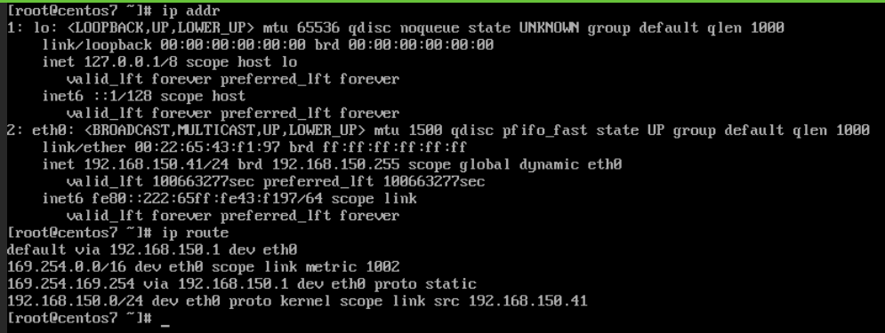
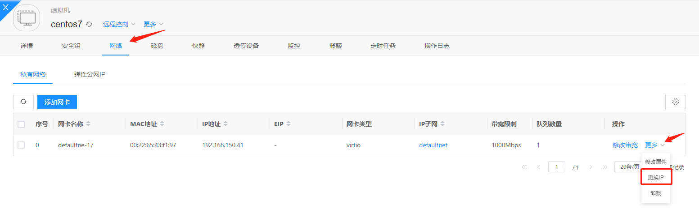
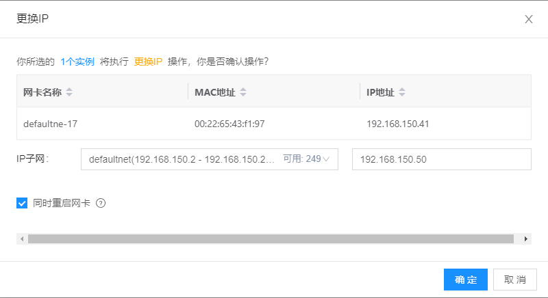
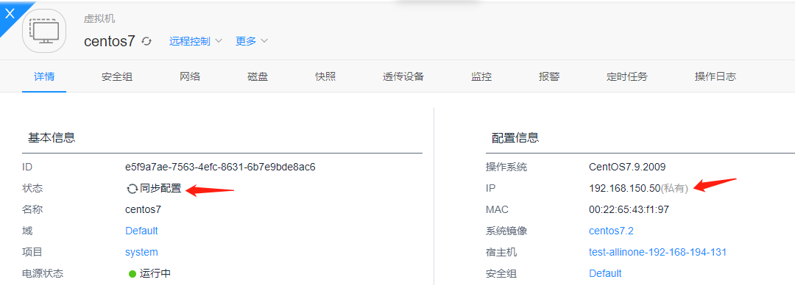
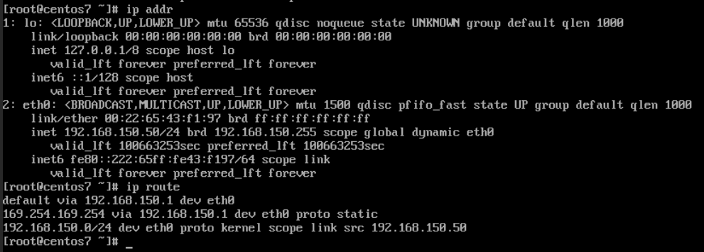

## 功能介绍

  使用 [qemu guest agent](https://wiki.qemu.org/Features/GuestAgent) 来操作虚拟机或者查看虚拟机的信息。


## 安装部署

  不同版本的操作系统安装方式不同，启动方式不同，以下列出一些操作系统安装方式。

### linux 安装启动

```bash
# 安装：
Debian     : apt-get install qemu-guest-agent
Ubuntu     : apt-get install qemu-guest-agent
Alpine     : apk add qemu-guest-agent
Arch Linux : pacman -S qemu-guest-agent
Kali Linux : apt-get install qemu-guest-agent
Fedora     :dnf install qemu-guest-agent-2
Raspbian   : apt-get install qemu-guest-agent

# systemd 启动或其他启动方式:
$ systemctl enable --now qemu-guest-agent

# 启动完成后可以在虚机内查看到 qemu-ga 的进程
# 例如 centos7 下，ps 可以看到 qemu-ga进程启动，并且禁用了一下命令:
$ /usr/bin/qemu-ga --method=virtio-serial --path=/dev/virtio-ports/org.qemu.guest_agent.0 --blacklist=guest-file-open,guest-file-close,guest-file-read,guest-file-write,guest-file-seek,guest-file-flush,guest-exec,guest-exec-status -F/etc/qemu-ga/fsfreeze-hook

# centos7 下 blacklist 配置是在 /etc/sysconfig/qemu-ga 下面
$ cat /etc/sysconfig/qemu-ga | grep BLACKLIST_RPC
BLACKLIST_RPC=guest-file-open,guest-file-close,guest-file-read,guest-file-write,guest-file-seek,guest-file-flush,guest-exec,guest-exec-status

# 也可以使用以下命令查看 blacklist 配置
$ ps -ef|grep qemu-ga|grep -E "blacklist=|b="
```

#### 修改黑名单配置
```bash
# 修改黑名单，编辑 /etc/sysconfig/qemu-ga 配置文件，将需要的命令从BLACKLIST_RPC中删除
$ vi /etc/sysconfig/qemu-ga

# 编辑完成后保存，重新启动 qemu-ga 服务：
$ systemctl restart qemu-guest-agent

# 重新查看qga的黑名单，确认是否配置成功
$ ps -ef|grep qemu-ga|grep -E "blacklist=|b="
```

### windows 安装启动

  windows 需要挂载 [virtio-win](https://fedorapeople.org/groups/virt/virtio-win/direct-downloads/archive-virtio/) 的 iso, 打开 iso 找到 guest-agent 目录 安装对应的 guest-agent.

## 使用介绍

执行 qga 命令需要确保虚机为 running(运行中) 的状态。若虚机内 guest-agent 未安装，则执行的命令会超时失败。

### 执行任意 qga 命令
```bash
$ climc server-qga-command  --help
Usage: climc server-qga-command [--help] <ID> <COMMAND>

Qga-Command server

Positional arguments:
    <ID>
        ID or name of the server
    <COMMAND>
        qga command

Optional arguments:
    [--help]
        Print usage and this help message and exit.

# 例如执行 guest-info 命令来获取 qga 的信息，包括 qga 版本，qga 支持的命令信息。
# 这是一个有用的命令来获取虚机内的 qga 支持和禁用了哪些操作。
$ climc server-qga-command test-server '{"execute": "guest-info"}'
supported_commands:
- enabled: true
  name: guest-sync-delimited
  success-response: true
- enabled: true
  name: guest-sync
  success-response: true
- enabled: true
  name: guest-suspend-ram
  success-response: false
- enabled: true
  name: guest-suspend-hybrid
  success-response: false
- enabled: true
  name: guest-suspend-disk
  success-response: false
- enabled: true
  name: guest-shutdown
  success-response: false
- enabled: true
  name: guest-set-vcpus
  success-response: true
- enabled: true
  name: guest-set-user-password
  success-response: true
- enabled: true
  name: guest-set-time
  success-response: true
- enabled: true
  name: guest-set-memory-blocks
  success-response: true
- enabled: true
  name: guest-ping
  success-response: true
- enabled: true
  name: guest-network-get-interfaces
  success-response: true
- enabled: true
  name: guest-info
  success-response: true
- enabled: true
  name: guest-get-vcpus
  success-response: true
- enabled: true
  name: guest-get-users
  success-response: true
- enabled: true
  name: guest-get-timezone
  success-response: true
- enabled: true
  name: guest-get-time
  success-response: true
- enabled: true
  name: guest-get-osinfo
  success-response: true
- enabled: true
  name: guest-get-memory-blocks
  success-response: true
- enabled: true
  name: guest-get-memory-block-info
  success-response: true
- enabled: true
  name: guest-get-host-name
  success-response: true
- enabled: true
  name: guest-get-fsinfo
  success-response: true
- enabled: true
  name: guest-fstrim
  success-response: true
- enabled: true
  name: guest-fsfreeze-thaw
  success-response: true
- enabled: true
  name: guest-fsfreeze-status
  success-response: true
- enabled: true
  name: guest-fsfreeze-freeze-list
  success-response: true
- enabled: true
  name: guest-fsfreeze-freeze
  success-response: true
- enabled: true
  name: guest-file-write
  success-response: true
- enabled: true
  name: guest-file-seek
  success-response: true
- enabled: true
  name: guest-file-read
  success-response: true
- enabled: true
  name: guest-file-open
  success-response: true
- enabled: true
  name: guest-file-flush
  success-response: true
- enabled: true
  name: guest-file-close
  success-response: true
- enabled: true
  name: guest-exec-status
  success-response: true
- enabled: true
  name: guest-exec
  success-response: true
version: 2.11.1
```

## qga 设置密码

 封装了 qga 设置密码的操作。
云平台会对密码的强度校验，并且会将设置完的密码加密后保存在元数据中以供后续查询。

```bash
$ climc server-qga-set-password  --help
Usage: climc server-qga-set-password [--help] <ID> <USERNAME> <PASSWORD>

Qga-Set-Password server

Positional arguments:
    <ID>
        ID or name of the server
    <USERNAME>
        Which user to set password
    <PASSWORD>
        Password content

Optional arguments:
    [--help]
        Print usage and this help message and exit.

# eg:
climc server-qga-set-password test-server root testPassword@1234
```

## qga 获取虚拟机的网卡信息
```bash
$ climc server-qga-get-network --help
Usage: climc server-qga-get-network [--help] <ID>

Qga-Get-Network server

Positional arguments:
    <ID>
        ID or name of the server

Optional arguments:
    [--help]
        Print usage and this help message and exit.

# eg:
$ climc server-qga-get-network test-server
- hardware-address: "00:00:00:00:00:00"
  ip-addresses:
  - ip-address: 127.0.0.1
    ip-address-type: ipv4
    prefix: 8
  - ip-address: ::1
    ip-address-type: ipv6
    prefix: 128
  name: lo
  statistics:
    rx-bytes: 0
    rx-dropped: 0
    rx-errs: 0
    rx-packets: 0
    tx-bytes: 0
    tx-dropped: 0
    tx-errs: 0
    tx-packets: 0
- hardware-address: 00:22:c8:10:5a:1c
  ip-addresses:
  - ip-address: 192.168.100.45
    ip-address-type: ipv4
    prefix: 24
  - ip-address: fe80::222:c8ff:fe10:5a1c
    ip-address-type: ipv6
    prefix: 64
  name: eth0
  statistics:
    rx-bytes: 6703
    rx-dropped: 0
    rx-errs: 0
    rx-packets: 62
    tx-bytes: 9460
    tx-dropped: 0
    tx-errs: 0
    tx-packets: 65
```

## qga 修改运行虚拟机的网络地址

#### 配置需求：
- qga 版本 ≥ 2.11.1
- 支持 guest-ping、guest-network-get-interfaces、guest-get-osinfo、guest-exec命令

#### 版本号查看：
qga 的版本号可以通过 guest-info 命令查看

#### 黑名单配置：
手动安装的 qga 默认的黑名单为空，即所有命令均可使用，不用进行额外配置，跳过该步骤。
centos7 版本之后系统自带 qga ，默认在部署虚拟机时已经对黑名单已经进行了处理，如果没有处理成功，可按照[修改黑名单配置](#修改黑名单配置)修改黑名单。

#### 使用方法
这里以 centos7 为例，介绍修改运行虚拟机的 IP 地址

虚拟机之前的网络地址和路由如图所示


在虚拟机管理页面选择 网络——更多——更换IP 修改虚拟机的 IP 地址


指定需要修改的 IP 地址，这里需要指定子网内的 IP 地址，因为要在运行状态下修改虚拟机的 IP ，需要勾选重启网卡按钮(默认勾选)


点击确定后，虚拟机进入配置阶段，等待虚拟机状态变为运行中，表示修改 IP 地址成功


虚拟机的 IP 地址和路由表都发生了修改


如果虚拟机使用 qga 修改网络配置失败，会调用ansible 修改网络配置

#### 注意事项：
- 使用 qga 修改网络配置时第一次可能会失败，但其实 qga 的状态是正常的，因此在第一次执行出错后会自动执行第二次，此时第二次的执行结果才是最终执行结果。
- 修改网络配置后的路由会变为静态路由
- windows 执行时间会相对长一点
- 使用 qga 修改网络配置失败可能是因为没有安装 qga、qga 版本过低或 qga 执行失败，需要逐步排查
