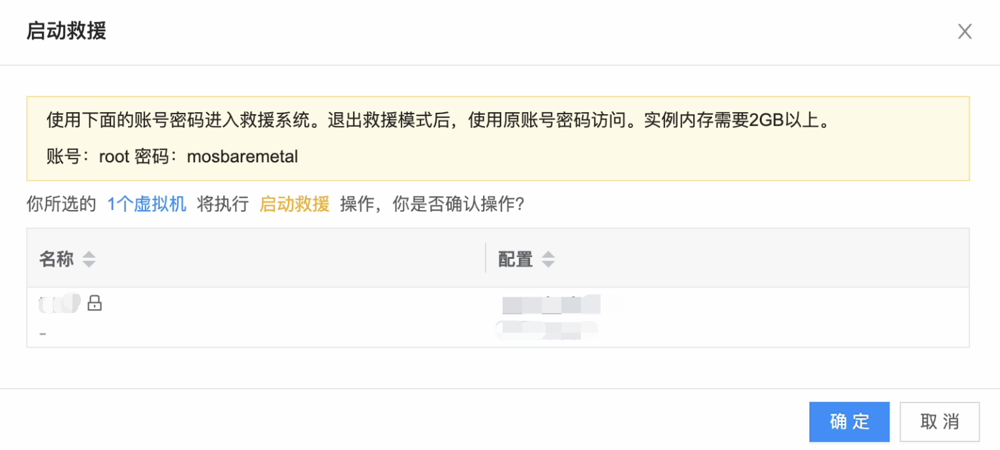

在私有云虚拟机的使用中，可能会存在损坏虚拟机文件系统的情况，此时提供一种方式以供用户进行恢复操作，并且可以在救援系统内部修复文件系统或者备份数据。

## 开启/关闭救援模式

目前启动救援模式的要求是虚拟机实例必须是运行或者停止状态，同时救援模式系统运行在RAM上，要求虚拟机实例的内存大于等于2G，此外，还需要[启用baremetal服务](https://www.cloudpods.org/zh/docs/function_principle/onpremise/baremetal/create_register_redirect/#%E5%90%AF%E7%94%A8baremetal%E6%9C%8D%E5%8A%A1)以获取`initramfs/kernel`启动文件。

> 说明：**预分配的救援系统的账号：root 密码：mosbaremetal**

### Web端

在虚拟机列表中，可以选择 `更多 > 实例状态`，在弹出的窗口中选择 `启动救援` 或 `退出救援`，即可进入或退出救援模式。




### 命令工具climc

针对climc方式，我们提供以下命令启动或停止云虚拟机：

使用`climc server-start-rescue` 命令启动救援模式，`climc server-stop-rescue` 命令关闭救援模式。

```bash
# 可通过 server-list 查找虚拟机的 id
$ climc server-list
```

使用查询到的虚拟机id，执行以下命令启动或停止救援模式。
```bash
# 启动救援模式
$ climc server-start-rescue <server_id>
```

```bash
# 关闭救援模式
$ climc server-stop-rescue <server_id>
```

### 连接救援操作系统

在启动救援模式后，可以使用现有的`登录到虚拟机`的方式来完成。

- ssh: linux 通用，要求虚拟机网络可达;
- vnc: vnc 链接，对虚拟机网络没有要求，只要能链接云平台 vnc proxy 即可;

> 救援模式的开发流程详见开发手册