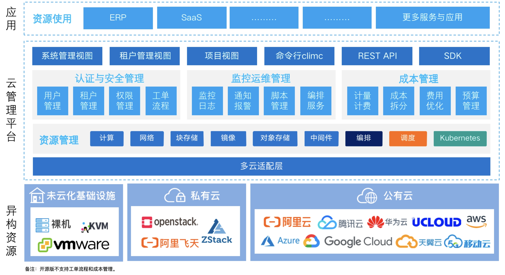

## 1 产品简介

{}

是一款简单、可靠的企业IaaS资源管理软件。帮助未云化企业全面云化IDC物理资源，提升企业IT管理效率。

帮助客户在一个地方管理所有云计算资源。统一管理异构IT基础设施资源，极大简化多云架构复杂度和难度，帮助企业轻松驾驭多云环境。

{}

## 2 产品特色

{}

的产品特色包括：
 - 开源：零门槛，线上快速获取和安装，核心代码完全托管于Github，迭代速度快；
 - 多云管理：一套系统，同时管理不同云上面的资源；
 - 多租户体系：一套系统通过我们的认证体系实现多个子公司和部门同时使用；
 - 多应用支持：数据库，Kubernetes；
 - 性能优越：云原生架构，全栈Golang；
 - 自主可控：100%完全由团队自主研发，自主知识产权；
 - 成熟稳定：自上市以来，受到了上百家企业客户的广泛验证；

{}

## 3 界面展示

## 4 功能列表

{}

 - 资源纳管，含阿里云、腾讯云、华为云等公有云；
 - 资源纳管，含OpenStack、ZStack等私有云；
 - 资源纳管，含VMware、裸机等；
 - 内置私有云；
 - k8s容器集群管理；
 - 监控与运维；
 - 多云SSO；
 - RBAC与IAM；
 - 命令行工具climc；
 - API与SDK；

{}

## 5 安全说明

{}

通过部署系统层面的网络安全措施，确保系统平台的安全，具体措施有：
- 组件之间的通信都是完全采用https加密，有效防止中间人攻击，回放攻击，防止信息被监听。
- 每个服务都采用独立的服务账号，每个服务访问数据库的账号都是独立的账号，避免账号信息泄露导致的风险。
- 服务之间的REST API调用都需要通过keystone的认证授权才可以使用，有效避免未经授权的API访问
- 采用网络安全策略，在私有化部署环境，采用calico network policy限制不必要的服务端口暴漏，在公有云部署环境，应用公有云VPC安全组策略限制不必要的服务端口暴漏，降低服务被网络攻击的风险

通过账户安全措施，保证平台的安全，主要措施有：
- 账户安全：为保证登录账户的密码安全，强制要求密码复杂度（密码长度和包含的字符种类），密码定期失效，历史密码重复校验等。
- 登录安全：为保证账户登录安全，开启多因子认证（MFA），强制限制用户只能有一个有效登录会话，允许禁用特定用户的控制台登录权限或API访问权限，如果一个用户多次密码登录失败则禁用账户

{}

## 6 商业产品

{}

[新一代企业级产品化融合云](https://www.yunion.cn/)

[新一代企业级产品化云原生私有云](https://www.yunion.cn/private/index.html)

[新一代产品化云原生多云管理平台](https://www.yunion.cn/cmp/index.html)

[公有云账单管理与优化（FinOps）](https://www.yunion.cn/finops/index.html)

{}

