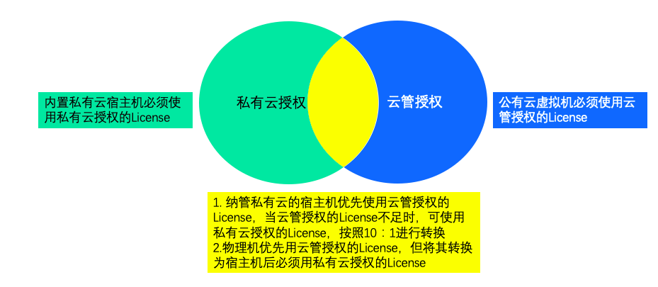
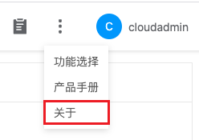
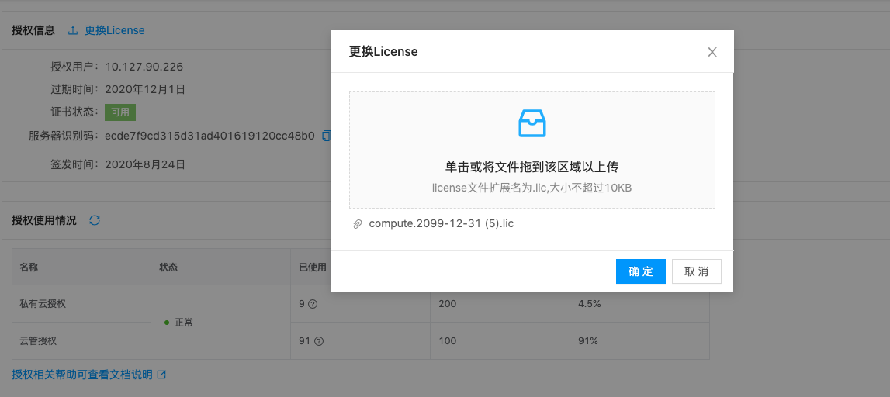

### License介绍

平台安装完成后，需要进行License授权操作，用户可以根据引导流程自助完成License申请操作。

#### License免费申请

平台License免费版本分为两种，不限时间试用版License、不限资源试用版License。

- 不限时间试用版License：6个宿主机CPU插槽；50个资源（虚拟机、RDS、Redis、LB）；永久；
- 不限配额试用版License：10000个CPU插槽；100000个资源（虚拟机、RDS、Redis、LB）；试用期30天；每个账号仅可以申请一次。

当上述License不满足用户需求时，可联系销售人员申请正式版License。

#### License应用范围

License根据使用场景分为私有云授权和云管授权。

私有云授权和云管授权使用场景如下：

- 私有云授权的License限制启用状态的宿主机CPU数量，即1颗CPU插槽使用1个私有云授权的 License。
- 云管授权的License限制运行状态的公有云虚拟机、RDS、Redis、LB的数量，即一台公有云虚拟机使用1个云管授权的License。
- 物理机优先使用云管授权的License，即1台物理机使用1个License，10台物理机使用1个私有云授权的License。
- 纳管私有云的宿主机优先使用云管授权的License时，宿主机1颗CPU使用10个云管授权的License。

{}
公有云虚拟机使用的云管收取的License数量取过去7天以内运行的平均虚拟机数量和当前运行的虚拟机数量的最小值。如果运行不足7天，则以过去最长运行时间的平均虚拟机数量计算。
{}

- License允许超额使用10%，当任意License使用率超过100%不足110%时，将会提醒用户申请新的License，当任意License使用率超过110%时，平台大部分功能将被禁用，仅可以使用删除和禁用功能。

## 授权流程

平台License授权时，需要用户提供服务器识别码。服务器识别码用于申请License文件，申请完成后使用License文件在平台上进行激活操作，即可成功激活产品。

服务器识别码是控制节点服务器的唯一标识，当用户部署多台服务器作为控制节点时，服务器授权码是包含所有组成控制节点的服务器的标识信息。后续增加或更换控制节点服务器都需要使用新的服务器识别码重新申请License文件。

{}
当控制节点由于迁移或其他原因，导致服务器识别码变化时，在两个小时内平台上将会同时显示旧服务器识别码和新服务器识别码，两个小时后将只显示新服务器识别码。
{}

License授权具体流程如下：

1. 获取服务器识别码：
   a. 以具有管理后台权限的用户登录云管平台。
   b. 单击顶部区域右上角图标，选项下拉菜单 **_"关于"_** 菜单项，进入关于页面。
   c. 单击服务器识别码右侧图标，复制服务器识权码。 
    
   
2. 申请企业版License：请您联系产品销售代表，提供“服务器识别码”，我们将根据商务约定时间及时提供License文件，请管理员将License文件保存到可以通过Web方式访问云管平台的机器的指定目录中。
3. 激活License：
   a. 以具有管理后台权限的用户登录云管平台.
   b. 单击顶部区域右上角图标，选项下拉菜单 **_"关于"_** 菜单项，进入关于页面。
   c. 单击授权信息右侧<更换License>按钮，将上一步骤保存的License文件拖拽到更换License对话框或单击 **_点击上传_** 按钮，选择上一步骤保存的License文件。单击 **_"确定"_** 按钮，提示“License更换成功”，授权信息中签发时间和过期时间将变为具体时间等。
   
   
   

 