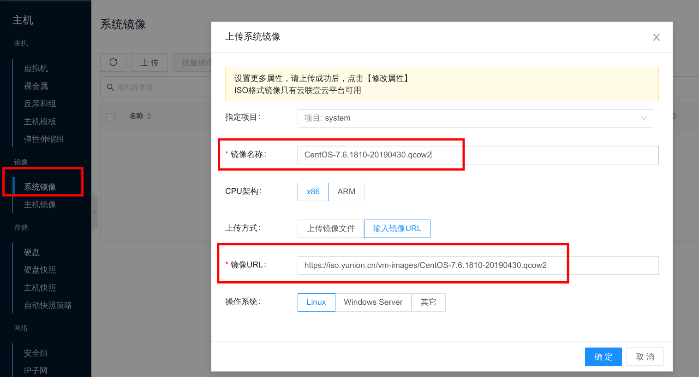

## {}私有云

如果是在私有云上部署 kubernetes 集群，需要先导入对应的镜像，操作如下：

1. 进入主机菜单，选择系统镜像的上传按钮
2. 输入镜像名称 'CentOS-7.6.1810-20190430.qcow2'
3. 上传方式选择 '输入镜像URL'，镜像 URL 为: https://iso.yunion.cn/vm-images/CentOS-7.6.1810-20190430.qcow2

等待镜像导入完毕后，就可以使用该镜像创建虚拟机部署 kubernetes 集群。

