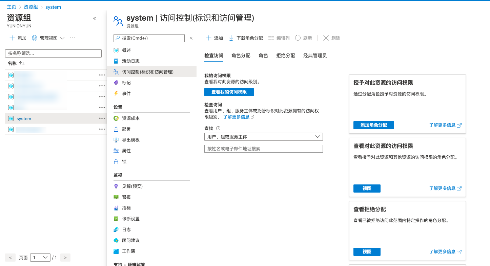
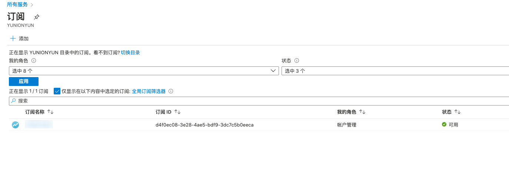

### [云平台权限表]()


{}

1. 使用主账号登录阿里云控制台，单击页面右上角个人信息，展开下拉菜单，单击 **_"访问控制"_** 菜单项 ，进入访问控制页面。
   

2. 单击左侧菜单栏 **_"用户管理"_** 菜单项，进入用户管理页面。
   

3. 在用户管理页面，单击指定用户操作列 **_"授权"_** 按钮，进行授权操作。
   

{}

{}

#### 如何把资源组的权限授权给应用程序

1. 登录Azure控制台，单击左侧导航栏 **_"资源组"_** 菜单项，查看资源组列表，单击需要被授权的资源组名称项，进入资源组管理页面。单击 **_"访问控制(标识和访问管理)"_** 菜单项，进入访问控制页面。
   

2. 在访问控制页面单击 **_添加角色分配_** 按钮，在进入的添加角色分配页面中设置角色为“所有者”，将访问权限分配到对话框为“用户、组或服务主体”、在选择搜索框中搜索上一步骤创建的应用程序的名称，并选中应用程序，单击 **_"保存"_** 按钮。
   

3. 在角色分配页面，查看资源组的权限已授权给了应用程序。

   

#### 如何把订阅的权限授权给应用程序

1. 登录Azure控制台，单击左侧导航栏 **_"所有服务"_** 菜单项，在所有服务列表中选择并单击 **_"订阅"_** 菜单项，进入订阅列表。
   

2. 单击需要被授权的订阅，进入订阅的详情页面；
   

3. 单击[访问控制(标识和访问管理)]，在进入的访问控制页面中单击 **_"添加角色分配"_** 按钮，进入添加角色分配页面。
   

4. 设置角色为“所有”、选择为上面步骤创建的应用程序关键字，并选中应用程序，单击 **_"保存"_** 按钮。
   

5. 在角色分配页面，查看订阅的权限已授权给应用程序。
   

#### 应用程序API权限设置

请确保应用程序拥有Azure Active Directory API下的以下权限。

区域 | API权限
---------|----------
 Azure中国 | Dictionary: Dictionary.Read.All, Dictionary.ReadWrite.All  Domain: Domain.Read.All
 Azure国际区 | Dictionary: Dictionary.Read.All, Dictionary.ReadWrite.All  Domain: Domain.Read.All, Domain.ReadWrite.All);  Member:  Member.Read.Hidden;  Policy: Policy.Read.All;
 
**查看及设置步骤**

以Azure国内区为例。

1. 在Azure控制台，单击左侧导航栏 **_"Azure Active Directory/应用注册"_** 菜单项，进入应用注册页面。
2. 在新注册的应用程序详情页面，单击 **_"API权限"_** 菜单项，进入API权限页面，查看API权限。

    

3. 检查应用程序的API权限是否满足上面的要求，如不满足，单击 **_"添加权限"_** 按钮，弹出请求获取API权限对话框。

    

4. 选择“Azure Active Directory”，应用程序选择“应用程序权限”，并勾选Dictionary和Domian下的所有权限，单击 **_"添加权限"_** 按钮，完成配置。

    

{}

{}
{}

{}
{}


