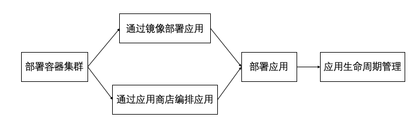

## 相关概念介绍

- 容器集群：即Kubernetes集群，包括控制节点和计算节点，部署在虚拟机上。
- 无状态（deployment）：deployment通过声明pod模板等信息部署无状态应用，适用于pod完全一样、没有顺序、无所谓运行在哪台主机的应用。
- 有状态（statefulset）：statefulset主要用于部署实例之间有不对等关系，以及实例对外部数据有依赖关系的有状态应用。
    - 基于statefulset部署的pod是有顺序的；
    - statefulset支持基于PVC实现持久化存储；
    - 基于hedless service实现稳定网络标志；
- 守护进程（Daemonset）：Daemonset可以确保全部（或者某些）节点上运行一个Pod的副本。当有节点加入集群时，也会为他们新增一个Pod。当有节点从集群移除时，这些Pod也会被回收。删除DaemonSet将会删除它创建的所有Pod。Daemonset典型用法如下：
    - 在每个节点上运行集群存守护进程
    - 在每个节点上运行日志收集守护进程
    - 在每个节点上运行监控守护进程
- 任务（job）：job用于部署仅执行一次的任务，job管理的pod根据用户设置处理任务，任务完成后pod就自动退出。
- 容器组（pod）：pod是Kubernetes编排的最小单位，是一组共享相同运行环境的容器组成。
- 服务（service）：Service 提供了一个或者多个Pod实例的稳定访问地址。
- 路由（ingress）：Ingress是将外部流量路由到service的规则集合。
- 配置项（configmap）：Configmap用于保存不需要加密的、应用所需的配置信息。
- 存储卷声明（persistentvolumeclaim）：pvc用于声明pod中容器的存储的请求，云管平台将会在虚拟机本地存储上创建符合pvc的存储。
- 保密字典（Secret）：secret用来保存密码、密钥、认证凭据等敏感信息。
- 容器编排：通过运维工具-编排-应用市场中的容器模板编排应用。

## 使用流程

  - 创建容器集群，包括控制节点和计算节点。
  - 在容器编排页面使用应用商店已有编排模板创建编排应用。
  - 在容器服务中根据需求基于镜像自定义创建部署（deployment）、有状态副本集（Statefulset）、任务（job）编排应用等。
  - 应用生命周期管理。
